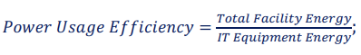
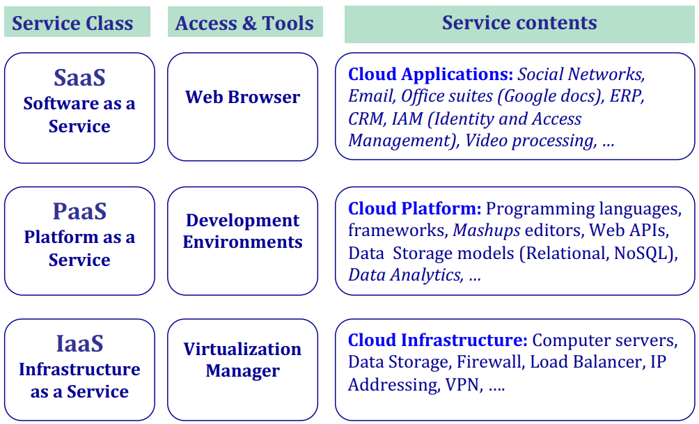

# Introdução à Computação na Nuvem

## Definição institucional

- O armazenamento, processamento e utilização de dados num computador remotamente alocado, acedido pela internet.

Utility Computing - A 5ª utilizade(água, eletricidade, gás, telefone)

- Acesso a recursos que são pagos à medida que são utilizados.

### Computação e armazenamento distribuído

- Incluí várias camadas: hardware, middleware.
- Uso de hardware de forma otimizada usando redes de computadores.

### Virtualização

- Facilidade de mudança de requisitos de hardware.

### Economia

- Possibilidade de pagar conforme a utilização (pay-per-use)

## Tipos de cloud

- **Cloud pública** - Fornecedores de serviço de computação remoto, e permite que qualquer utilizador se registe e utilize os recursos.
- **Cloud privada** - Infraestrutura exclusiva a uma organização, geralmente algo que permite alojar serviços a pedido.
- **Hybrid cloud** - Composição de infraestruturas de cloud distintas, que interoperam através de modelos e tecnologias, que permite ter um pouco o melhor dos dois mundos.
- **Community cloud** - Exclusiva a uma comunidade de consumidores que partilham os mesmos objetivos.

## Cloudnomics

- Custos totais (TCO - Total Cost of Ownership):
  - **Capex** - Capital Expenditure
    - São despesas que criam benefícios futuros. Nomalmente requer um grande investimento inicial, porém é amortizado ao longo do tempo.
  - **Opex** - Operational Expenditure
    - Custo contínuo para execução de um produto, empresa ou sistema. É uma despesa diária que pode muito mais facilmente ser aumentada ou diminuída conforme as necessidades do negócio.
- Para tentar prever os custos de soluções de IT é preciso:
  - Licenciamento de software;
  - Contratos manutenção de hardware e software;
  - Custos investimento em novo hardware;
  - Custos de recursos humanos(serviços) em ações de manutenção;
  - Custos energéticos (eletricidade, ar condicionado);

## Teorema CAP

- Consistency, Availability, Partition Tolerance

- **Num sistema distribuído que partilhe dados só podemos ter 2 das 3 propriedades.**

- **Consistência** - Cada leitura observa a última escrita. O sistema oferece um estado consistente para **todos** os observadores.
- **Disponibilidade** - O sistema continua a funcionar (eventual degradaao na qualidade de serviço) na presença de falhas ou de falta de conectividade de alguns nós.
- **Tolerância a particionamento** - O sistema continua a funcionar apesar de haver atraso ou falha na entrega de mensagens.

- Normalmente os sistemas distribuídos são **AP** ou **CP**.

