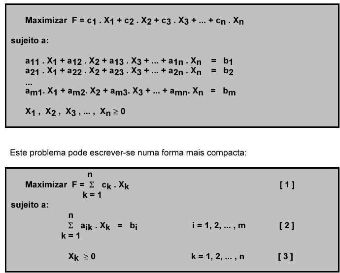
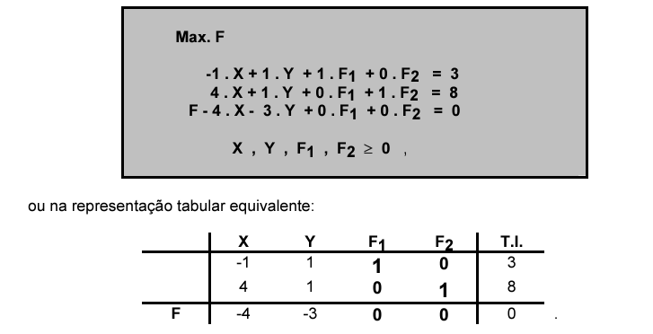
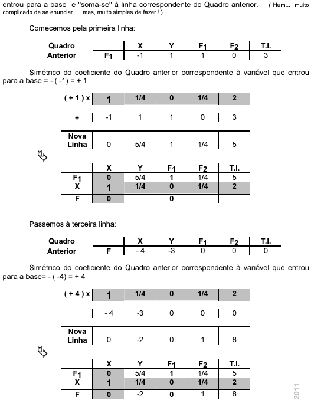

# 1º Teste

## Tipos de problemas e diferentes transformações

Passar os problemas para a forma **standard** muitas vezes ajuda a resolver o problema.

### Transformação de forma geral para "Forma Canónica"

- 1º Passo: Garantir que a **função objetivo** é de maximização. Se não for, Min(Z) <=> Max(-Z). G = -Z.

- 2º Passo: Garantir que todas as restrições são de <=.
  - Quando temos uma restrição de >=, multiplicamos por -1 dos dois lados.
  - Quando temos uma restrição de =, dividimos por 2 e criamos duas restrições, uma de <= e outra de >=, convertendo de seguida a restrição de >= para <=, como no passo anterior.
- 3º Passo: Garantir que todas as variáveis são não negativas.
  - Se tivermos uma variável negativa (<=0) multiplicamos por -1 e assumimos que é uma nova variável. i.e. Y1=-X1 e X1>=0. **Substituimos então X1 por Y1 nas restrições e na função objetivo.**
  - Se tivermos uma variável livre (X2 E R) podemos então escrever esta variável como a diferença de duas variáveis não negativas. i.e. X2 = Y2 - Z2, com Y2, Z2 >= 0. **Substituimos então X2 por Y2 - Z2 nas restrições e na função objetivo.**
- **Após a resolução do problema, obter-se-ia os valores ótimos das variáveis Y1, Y2, Z2, etc. e da função objetivo G. Parta obter os valores das variáveis originais, basta substituir os valores obtidos nas variáveis auxiliares.**

### Transformação "Forma canónica" para "Forma standard"

Não há alterações a fazer na função objetivo nem nas variáveis. Basta apenas **transformar as restrições do tipo <= (da forma canónica) para o tipo = (da forma standard).**

Imagine-se que se pretende transformar a restrição **2 . X1 + 6 . X2 + 3 . X3  ≤  50** numa igualdade.  Tal pode ser feito com facilidade, mediante a introdução de uma **variável de folga ou de desvio F1 ( F1 ≥ 0 ) :**  

**2 . X1 + 6 . X2 + 3 . X3  ≤  50  ⇔  2 . X1 + 6 . X2 + 3 . X3  + F1  =  50 , com F1 ≥ 0.**

Observemos que quando **F1 = 0**, se tem **2 . X1 + 6 . X2 + 3 . X3  = 50** ; pelo contrário, se **F1 > 0**, tem-se **2 . X1 + 6 . X2 + 3 . X3  < 50**, isto é, tal como se pretendia tem-se **2 . X1 + 6 . X2 + 3 . X3  ≤  50**.

- Assim, para se re-escrever na forma standard, basta adicionar uma variável de folga ou de desvio a cada restrição de <=.

### Transformação de "Forma geral" para "Forma standard"

Para a função objetivo e as variáveis basta levar a cabo os procedimentos já descritos na transformação de "Forma geral" para "Forma canónica". Para as restrições, de <= ou >=, basta adicionar, ou subtrair, uma variável de folga ou de desvio, respetivamente, de modo a que todas as restrições sejam de igualdade.

> Para converter a igualdade, Menos (<=) é mais (+F1), Mais (>=) é menos (-F1).

## Formulação de problemas

Na formulação de problemas é util responder a 3 questões importantes:

- Qual o **objetivo** a atingir?
  - Max/Min -> Função objetivo.
- Que **atividades** (com influência no objetivo) devem ser levadas a cabo? Que decisões devem ser tomadas?
  - Qual a sua intensidade? (**QUANTO????**, quando necessário **ONDE??**) -> **X** - Variáveis de decisão.
  - **Atenção ao cuidado a ter na definição das variáveis... Não esquecer as unidades e não esquecer o carácter de não negatividade das variáveis.**
- Que recursos são consumidos quando se leva a cabo as atividades? que condicionalismos são impostos? 

Sempre que possível definir as variáveis de **forma genérica**: 

 Genericamente **Xij** é a quantidade (em toneladas) de farinha i = A ; B a produzir semanalmente na fábrica Fj , j = 1  ; 2 , isto é, por exemplo,  XA1 é a quantidade (em toneladas) de farinha A a produzir semanalmente na fábrica F1.

## Conceitos fundamentais

Consideremos um problema de programação linear apresentado na sua forma standard:

Na representação anterior, o vetor das incógnitas **X** é um vetor coluna (n x 1), o vetor dos coeficientes da função objetivo **C** é um vetor linha (1 x n), a matriz dos coeficientes das restrições **A** é uma matriz (m x n) e o vetor dos termos independentes **b** é um vetor coluna (m x 1). De notas que **0** é o vetor nulo do tipo (n x 1).

N VARIÁVEIS E M RESTRIÇÕES (sendo n > m) podem apresentar-se as seguintes definições:

- **Solução** é todo o n-uplo ( v1, v2, ... , vn ) associado às variáveis ( X1, X2, ... , Xn ) que verificam as restrições [ 2 ].
- **Solução admissível** é toda a solução que verifica as condições de não negatividade [ 3 ] .
- **Solução básica ( s.b. )** é toda a solução constituída por **( n - m ) variáveis não básicas ( variáveis com valor nulo )**, sendo as restantes **m variáveis básicas** determinadas univocamente.   Relativamente a uma solução básica, designa-se por **base** o conjunto das variáveis básicas. 
- **Solução básica admissível não degenerada** é toda a s.b.a. cujas variáveis básicas tomem valores estritamente positivos.   **Se alguma variável básica de uma s.b.a. for nula, estar-se-á perante uma solução básica admissível degenerada.**
- **Solução óptima é toda a solução que torna máximo o valor da função objectivo [ 1 ]. [ Geralmente, só nos interessa determinar uma solução óptima que seja admissível ... ]**

**Se tivermos mais que n-m número de variáveis nulas, então estamos perante uma solução básica degenerada, se for exatamente n-m então estamos perante uma solução básica admissível não degenerada.**

Num problema de programação linear com m restrições e n variáveis (na forma standard) [n > m], uma solução é básica se tiver m variáveis básicas e (n-m) variáveis não básicas. Porém, nem toda a solução básica é admissível, assim poderemos apenas indicar um **limite superior para o número de soluções básicas admissíveis de um problema de programação linear com m restrições e n variáveis (na forma standard): C^n m = n ! / ( m ! / ( n - m ) ! ).**

**Teorema Fundamental da Programação Linear:** Se existe uma solução admissível, então existe uma solução básica admissível, e se existe uma solução ótima admissível, então existe uma solução básica ótima admissível.

## Resolução de problemas

### Método gráfico

- TODO: Fazer depois.

### Algoritmo Simplex Primal

- Objetivo: De um "modo inteligente" analisa as soluções básicas admissíveis, de modo a encontrar a(s) solução(ões) ótima(s).

**Passos:**

1. Re-escrever o problema na forma standard
2. Arbitrar uma solução básica inicial (nº de variáveis básicas (não nulas) é igual ao nº de restrições) e n-m variáveis não básicas (nulas).
3. Verificação da otimalidade da solução em análise.
   1. Para isto é necessário re-escrever a função objetivo apenas em função das variáveis não básicas.
   2. Se encontrarmos uma variável não básica com coeficiente positivo, então a solução não é ótima. (isto significa que se incrementarmos o valor de uma dessas variáveis, o valor da função objetivo também aumenta).
4. Seleção da variável que entra na base (base é o conjunto das variáveis básicas)
   1. A variável que entra na base é a variável (até aqui não básica) que tem o maior coeficiente positivo, pois o seu incrementendo de uma unidade é o que mais aumenta a função objetivo.
5. Seleção da variável que sai da base
   1. Qual o incremento máximo que a variável selecionada para entrar na base pode tomar? Para isto, vamos analisar as restrições do problema, e verificar o que acontece  quando escrevemos a restrição escrita em função das variáveis básicas que lhe estão associadas e da variável que entra na base.
   2. **TODO: FALTA COMPLETAR**

**Para re-escrever a função objetivo apenas em função das variáveis não básicas por vezes é necessário fazer substituição pelas restrições isolando a variável básica em função das não básicas.**

**Sempre que possível toma-se as variáveis de folga como variáveis básicas iniciais, (Isto só é possível quando todas as restrições são do tipo <=).**

#### Resolução com o Quadro do Simplex

Entra na base a com o coeficiente mais negativo

#### Resolução Matricial

