# SRSC

## Conceitos Chave

- **Confidencialidade:** Preserving authorized restrictions on information access and disclosure, including means for protecting personal privacy and proprietary information. A loss of confidentiality is the unauthorized disclosure of information.
  - **Confidencialidade de dados:** Garante que informação privada ou confidencial não está disponível nem é divulgada para pessoas não autorizadas.
  - **Privacidade:** Garante que indivíduos controlem ou influenciem que informação relacionada com eles é que pode ser recolhida e armazenada e por quem e para quem é que esta informação pode ser divulgada.
- **Integridade:** Guarding against improper information modification or destruction, and includes ensuring information non-repudiation and authenticity. A loss of integrity is the unauthorized modification or destruction of information.
  - **Integridade de dados:** Garante que informação (armazenada e transmitida em packets) e programas sõ são mudados de forma autorizada.
  - **Integridade do sistema:** Garante que um sistema realiza o seu propósito de forma correta, sem manipulação maliciosa. 
- **Disponibilidade:** Garante que sistemas funcionam prontamente e o serviço não é negado a utilizadores autorizados. Ensuring timely and reliable access to and use of information. A loss of availability is the disruption of access to or use of information or an information system.

- **Autenticidade** - A propriedade de ser genuino e conseguir ser verificado e confiável; Confidência na validação de uma transmissão, mensagem, ou origem. Isto significa verificar que os utilizadores são quem dizem ser, e que os dados que chegam ao sistema vieram de uma fonte confiável.
- **Accountability** - O objetivo de segurança que gera o requesito para ações de uma entidade serem atribuídas exclusivamente a essa entidade. Isto suporta não-repúdio, deteção de intrusões, recuperação pós-incidente e ações de auditoria. Porque sistemas verdadeiramente seguros ainda não existem, é preciso conseguir rastrear uma falha de segurança aos responsáveis. Sistemas devem manter registos das suas atividades, para que se possa identificar quem fez o quê.

**TODO: Ver que serviços eles garantem bem.**

## Tipos de Ataques

- **Ataques passivos** - Tentam aprender ou fazer uso de informação do sistema, sem afetar os seus recursos.
- **Ataques ativos** - Tentam alterar ou afetar o sistema, ou os seus recursos.

### Ataques passivos

- **São da natureza de escuta**, monitorização ou transmissão. 
- O objetivo do adversário é obter informação que está a ser transmitida. Dois tipos de ataques passivos são **revelação de conteudo de mensagens** e **análise de tráfego**.
- **Revelação de conteudo de mensagens** - Queremos prevenir que um adversário consiga aprender o conteudo de uma mensagem que está a ser transmitida.
- **alálise de tráfico** - Mais subtil. Suponhamos que temos uma maneira de esconder o conteudo da mensagem ou outras informações que tráfico, de maneira que mesmo se o oponente capturar a mensagem, não consiga aprender nada (por exemplo, cifrando a mensagem). O adversário pode ainda tentar **observar padrões na mensagem.** **O adversário pode determinar a localização e identidade dos participantes, e observar a frequência e o tamanho das mensagens.** Isto pode ser relevante para adivinhar a natureza da comunicação. Estes ataques são **muito difíceis de detetar**, porque não envolvem qualquer alteração de dados. Tipicamente, o tráfico da mensagem é enviado e recebido de forma normal, e sem que os participantes saibam que estão a ser observados. Contudo, é possível **prevenir** o sucesso destes ataques, **através de técnicas de encriptação**. Então, a enfase em lidar com estes ataques é **prevenir** ao invés de **detetar**.

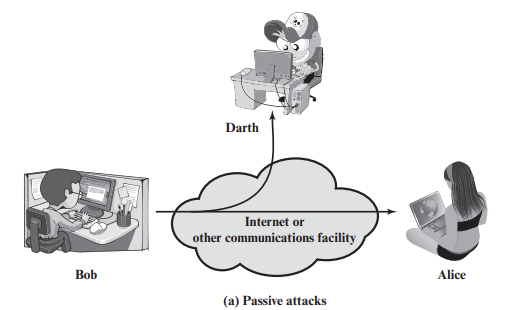

### Ataques ativos

- Envolvem modificação da stream de dados ou a criação de uma falsa stream que pode ser subdividido em 4 categorias: 
- **Masquerade** - **Tem lugar quando uma entidade aparenta ser outra entidade.** Normalmente inclui uma das outras formas de ataques ativos. Por exemplo, podem ser capturadas sequências de autenticação depois de uma autenticação válida ter acontecido, possibilitando uma entidade com poucos previlégios de se passar por uma entidade com mais previlégios.
- **Replay** - Envolve a captura passiva de dados e a sua retransmissão para obter acesso não autorizado a um sistema.
- **Modification of Messages** - Significa que uma porção legitima da mensagem foi alterada, ou que as mensagens foram reordenadas, para produzir um efeito indesejado.
- **Denial of Service** - Previne ou dificulta o uso de um sistema ou serviço. Pode ser feito de várias formas, como **floodar** um sistema com pedidos, **crashar** um sistema, ou **sobrecarregar** um sistema com pedidos de forma a que ele não consiga responder a pedidos legítimos.

Ataques ativos são muito difíceis de prevenir na sua totalidade, por toda a range de possíveis ataques, físicos, de software ou de vulnerabilidades na rede. Em vez disso **o objetivo é detetar ataques ativos** e recuperar de qualquer dano causado por eles. Se a sua deteção tiver um efeito dissuasor, então pode contribuir para a prevenção.

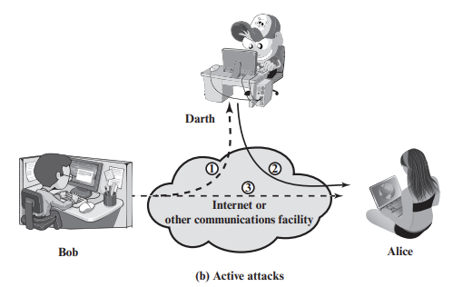

## Relação entre serviços de segurança e mecanismos

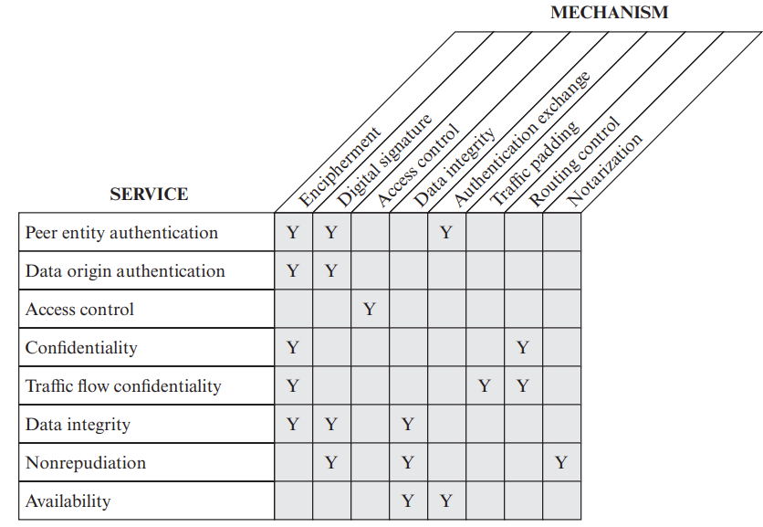

## Algoritmos

- Algoritmo da divisão
- Algoritmo euclidiano - MDC (Máximo Divisor Comum)

## Algoritmos de cifra simétrica

- No mínimo, gostariamos de ter um algoritmo que mesmo que o adversário conheça o algoritmo e tenha acesso a uma ou mais mensagens cifradas, não consiga decifrar a mensagem sem a chave, ou descobrir a chave.

- Types of Attacks on Encrypted messages:

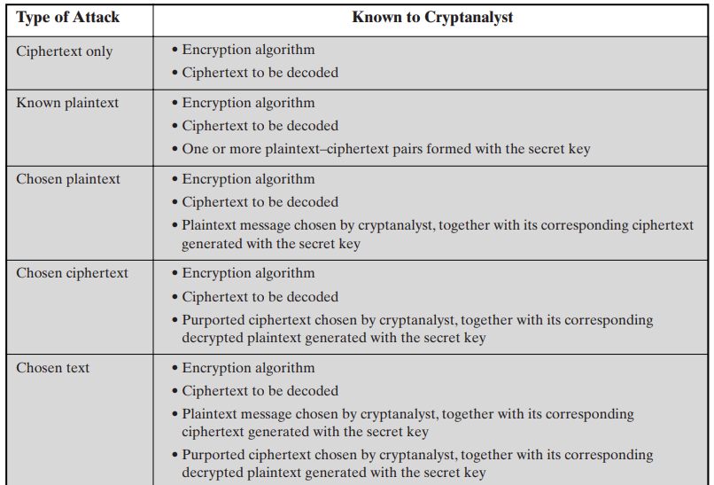

### Block Ciphers

The Feistel structure is a particular example of the more general structure
used by all symmetric block ciphers. In general, a symmetric block cipher consists of
a sequence of rounds, with each round performing substitutions and permutations
conditioned by a secret key value.

- **Block size:** Larger block sizes mean greater security (all other things being equal) but reduced encryption/decryption speed. A block size of 128 bits is a reasonable tradeoff and is nearly universal among recent block cipher designs.
- **Key size:** Larger key size means greater security but may decrease encryption/decryption speed.The most common key length in modern algorithms is 128 bits.
- **Number of rounds:** The essence of a symmetric block cipher is that a single round offers inadequate security but that multiple rounds offer increasing security. A typical size is 16 rounds.
- **Subkey generation algorithm:** Greater complexity in this algorithm should lead to greater difficulty of cryptanalysis.
- **Round function:** Again, greater complexity generally means greater resistance to cryptanalysis.

**There are two other considerations in the design of a symmetric block cipher:**

- **Fast software encryption/decryption:** In many cases, encryption is embedded in applications or utility functions in such a way as to preclude a hardware implementation. Accordingly, the speed of execution of the algorithm becomes a concern.
- **Ease of analysis:** Although we would like to make our algorithm as difficult as possible to cryptanalyze, there is great benefit in making the algorithm easy to analyze. That is, if the algorithm can be concisely and clearly explained, it is easier to analyze that algorithm for cryptanalytic vulnerabilities and therefore develop a higher level of assurance as to its strength. DES, for example, does not have an easily analyzed functionality.

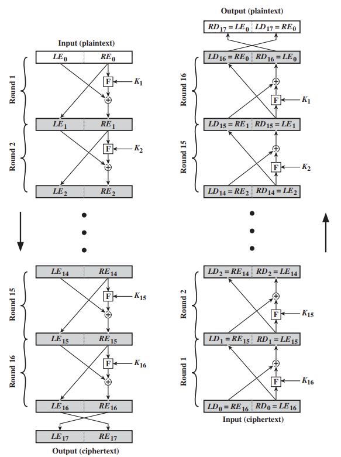

The process of **decryption with DES** is essentially the same as the encryption
process.The rule is as follows: Use the ciphertext as input to the DES algorithm, but
use the subkeys Ki in reverse order. That is, use K16 on the first iteration, K15 on the
second iteration, and so on until K1 is used on the 16th and last iteration.

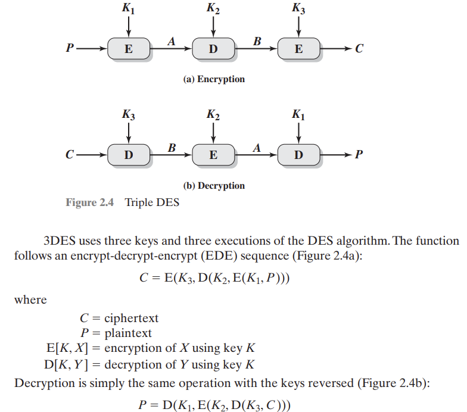

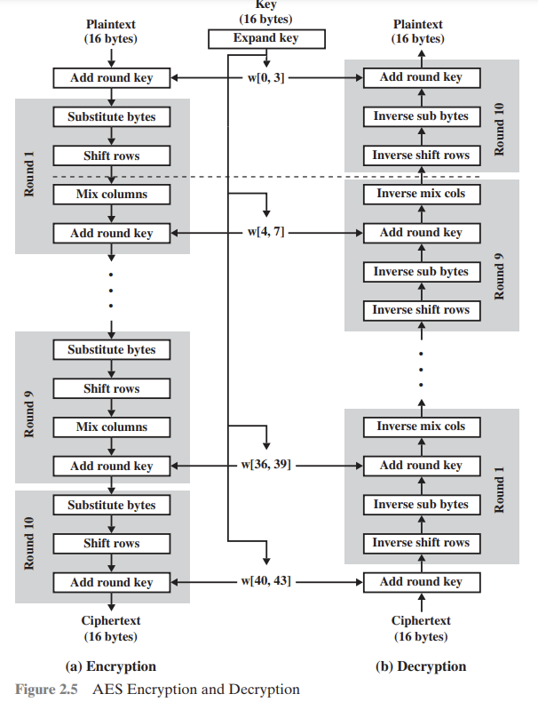

### Stream Ciphers

- **Stream ciphers** operate on a single bit (byte or computer word) at a time and implement some form of feedback mechanism so that the key is constantly changing. Stream ciphers come in several flavors but two are worth mentioning: synchronous (a new key for each bit) and self-synchronizing (a new key for each character).

- **RC4** - The most widely used stream cipher is RC4. RC4 is a variable key-size stream cipher with byte-oriented operations. The algorithm is based on the use of a random permutation. The key length can vary from 1 to 256 bytes. The algorithm is simple and fast and is commonly used in secure Web browsing.

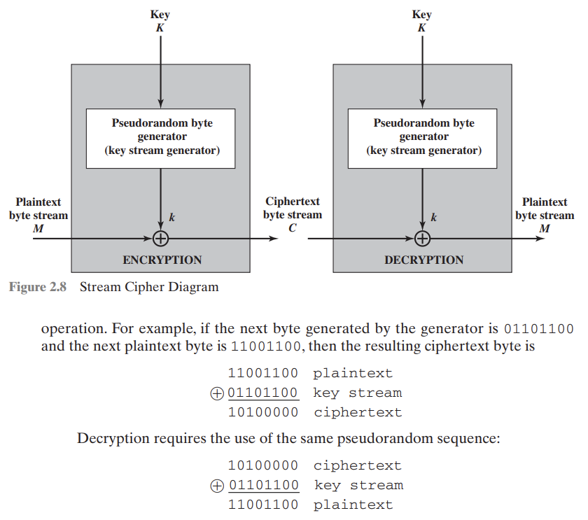

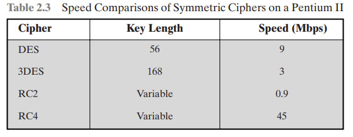

### Block Cipher Modes of Operation

- **Electronic Codebook (ECB) mode:** The message is divided into blocks, and each block is encrypted separately. The term Codebook means that, for a given key, there is a **unique** ciphertext for every b-bit block of plaintext. Therefore, if the same block of plaintext appears more than once in the message, it always produces the same ciphertext. This mode is the simplest to implement but is susceptible to a variety of brute-force and statistical attacks. ECB mode is used when a volume of data is small and/or a separate key is used for each block.
  - **Confidenciality:** weak, because identical plaintext blocks produce identical ciphertext blocks.
  - **Integrity:** Not guaranteed. Any block can be modified without affecting other blocks (no chaining).
  - **Error Propagation:** No error propagation. Errors in a ciphertext block affect only that block.
- **Cipher Block Chaining (CBC) mode:** The message is divided into blocks, and each block is XORed with the previous ciphertext block before being encrypted. The initialization vector (IV) is XORed with the first block of plaintext before the block is encrypted. The IV is a random number that is used to ensure that the first block encrypts differently each time the same message is encrypted. CBC mode is used when a volume of data is large and/or a single key is used for the entire message. **If we don't protect the IV, the attacker can change the IV and is able to invert selected bits in the first block of plaintext.**
  - **Confidentiality**: Strong, identical plaintext blocks will produce different ciphertext blocks **as long as the previous ciphertext block (or iv) is different.**
  - **Integrity:** Not Guaranteed by itself. It is possible to manipulate the ciphertext.
  - **Error Propagation:** High. An error in one ciphertext block will affect the decryption of the current block and all subsequent blocks.
- CBC is widely used, especially in older protocols. However, it requires a random IV and careful handling to prevent certain attacks.

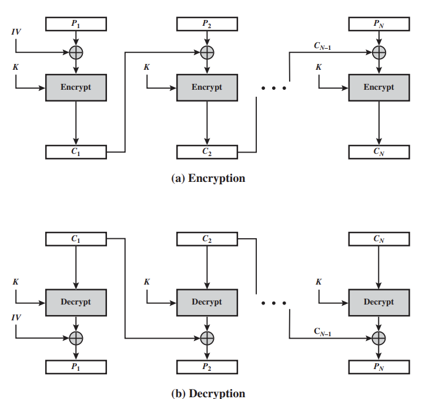

- **Cipher Feedback (CFB) mode:** The message is divided into blocks, and the ciphertext of the previous block is encrypted and then XORed with the plaintext block to produce the ciphertext block. The IV is used as the input to the encryption algorithm to produce the first ciphertext block. CFB mode is used when a volume of data is large and/or a single key is used for the entire message. This turns the block ciper into a **self-synchronizing stream cipher**.
  - **Confidentiality:** Strong, like CBC, uses an IV to ensure that identical plaintext blocks produce different ciphertext blocks.
  - **Integrity:** Not guaranteed. It is possible to manipulate the ciphertext.
  - **Error Propagation:** Somewhat limited. A bit error in the ciphertext will afect only the corresponding part of the current block and the next block.
- **Useful for situations where block-by-block encryption is needed, such as in network communications.**

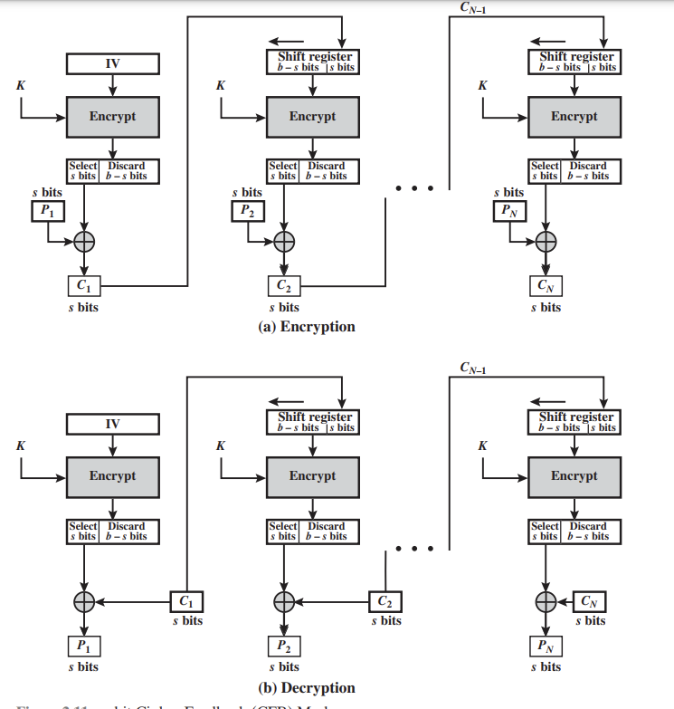

- **Counter (CTR) mode:** The message is divided into blocks, and each block is XORed with the output of the encryption algorithm using a counter. The counter is incremented for each block. The IV is used as the input to the encryption algorithm to produce the first counter block. CTR mode is used when a volume of data is large and/or a single key is used for the entire message.

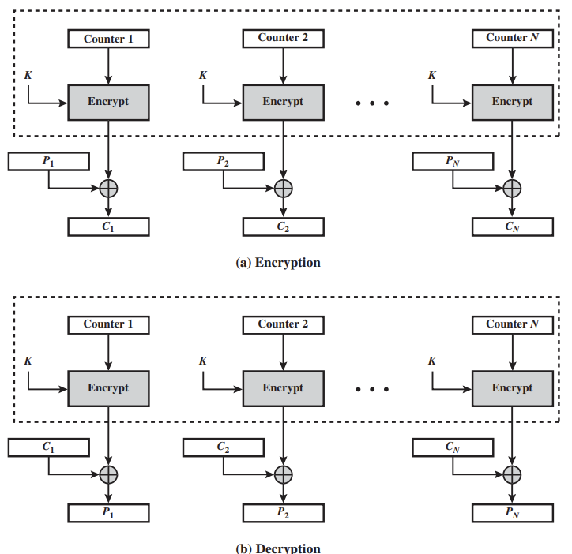

## Coisas a estudar

- Estudar conceitos chaves
  - Disponibilidade
  - Privacidade
  - Confidencialidade de dados
  - Integridade do sistema
  - Integridade dos dados

- Estudar tipos de ataques
  - Ataques passivos
  - Ataques ativos
  - Ataques de negação de serviço
  - Ataques de elevação de privilégios
  - Ataques de spoofing
  - Ataques de injeção
  - Ataques de buffer overflow
  - Ataques de SQL injection
  - Ataques de Cross-Site Scripting
  - Ataques de Cross-Site Request Forgery

- Criptografia simétrica
  - Modos
  - Tipos
  - Padding
  - IV
  - Como calcular bloco random de uma cifra simétrica