# Lesson 8 - Evaluation Strategies + Parameter Passing

# Lesson 9 - Compilation of Object-oriented Languages

# Lesson 10 - Compilation of Functional Languages

## First-class functions

- First class functions, significa que funções são tratadas como valores, podendo ser passadas como argumentos, retornadas de outras funções, guardadas numa estrutura de dados, construir novas funções dinamicamente, etc.
- Logo, não podemos compilar funções da mesma maneira, porque perdemos o seu contexto.
- A solução é usar um **closure** (fecho), que é uma estrutura de dados heap-allocated (para sobreviver a function calls) que contém:
  - **Um pointer para o código (o body da função)**
  - Os **valores das variáveis livres** que podem ser necessárias por este código, chamado de **environment**.
- The set fv(e) of the free variables of the expression e is computed as follows:

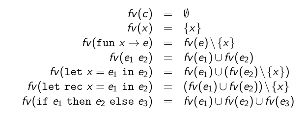

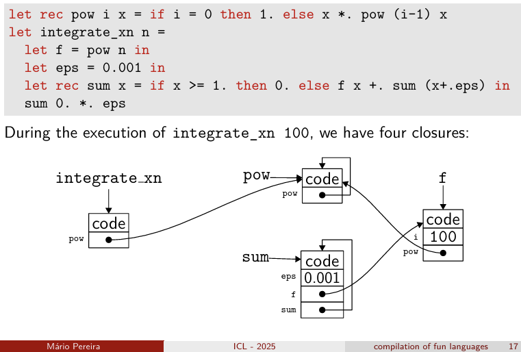

- Uma boa maneira de compilar closures é em dois passos:
  - Primeiro, substituir todas as fun x -> e por construções explicitas de closure, em clos f [y1, ..., yn] , onde yi são as variáveis livres de fun x -> e e f é o nome de uma função global letfun f [y1, ..., yn] x = e', onde e' é derivado de e, by replacing constructions fun recursively (**closure conversion**)
  - Segundo, compilar o código obtido, que só contem declarações de letfun functions.

- Cada função tem um único argumento, passado no registo %rdi, O closure é passado no registo %rsi.
- O stack frame é o seguinte, onde v1,...,vm são as variáveis locais:

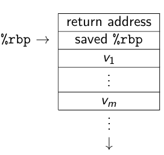

- Para compilar clos f [y1,..., yn] fazemos o seguinte:
  - Alocamos um bloco de tamanho n + 1 no heap com malloc
  - Guardamos o endereço de f no primeiro campo do bloco
  - guardamos os valores de y1,..., yn nos restantes campos do bloco
  - retornamos o ponteiro para o bloco
- Nota: a dealocação do bloco é feita pelo garbage collector.

- Para compilar e1 e2, fazemos:
  - Compilamos e1 para o registo %rsi (o seu valor é um p1 para o closure)
  - Compilamos e2 para o registo %rdi
  - Chamamos a função com o adereço obtido pelo primeiro campo do closure com `call *%rsi` isto é um jump para um endereço dinamico.

- Para compilar o acesso à variável x, distinguimos os 4 casos:
  - **global variable** - o valor é guardado no endereço dado pelo label x
  - **local variable** - o valor está em n(%rbp) / num registo
  - **variable contained in a closure** - o valor está em n(%rsi) / num registo, onde n é o número de variáveis livres antes de x
  - **function argument** - o valor está em %rdi (o primeiro argumento da função)

- Para compilar a declaração letfun f [y1,..., yn] x = e, fazemos:
  - salvar e setar %rbp
  - alocar espaço no stack para as variáveis locais
  - avaliar e no registo %rax
  - apagar o stack frame e restaurar %rbp
  - executar `ret` para retornar o valor no registo %rax

## Tail call optimization

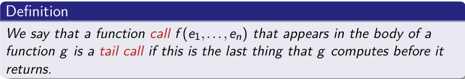

- A **tail call** é uma chamada de função que é a última ação de uma função, ou seja, não há mais código a ser executado após a chamada.

- Nós podemos apagar o stack frame da função que faz a tail call antes de fazer a chamada, porque não precisamos mais dele.
- Melhor, podemos reutilizar para fazer a tail call, em particular o endereço de retorno. **Ou seja, podemos fazer um jump em vez de um call.**

## Pattern-matching

- O objetivo do compilador é transformar instruções de alto nível numa sequência de testes elementares (constructor tests and constants comparison) e aceder aos campos de dados necessários.
- Consideremos a construção `match x with p1 -> e1 | ... | pn -> en`, onde pi são padrões e ei são expressões.
- Um padrão é definido pela sintax abstrata:
- p::= x | C(p,...,p)
- Onde C é um construtor que pode ser:
  - Uma constante
  - Um construtor constante de um tipo algébrico, como [] ou por exemplo, Empty como type t = Empty | ...
  - Um construtor com argumentos como :: ou por exemplo Node as in type t = Node of t * t | ...
  - Um construtor de um n-tuplo com n >=2
- Dizemos que um padrão p é linear se todas as variáveis são usadas no máximo uma vez em p.
- Também se pode incluir padrões em valores: v::=C(v,...,v)
- Dizemos que um valor dá match no padrão p se existir uma substituição σ, de variáveis em valores tal que v = σ(p).

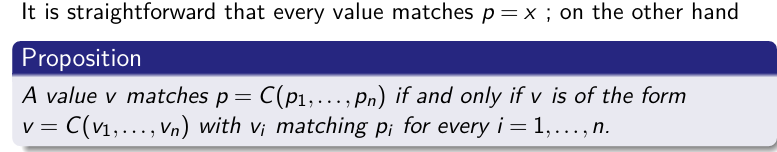

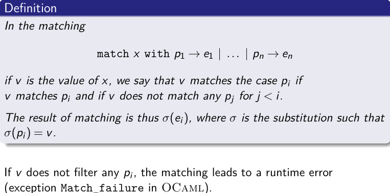

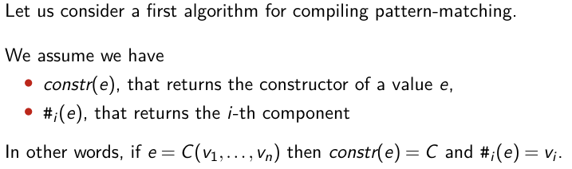

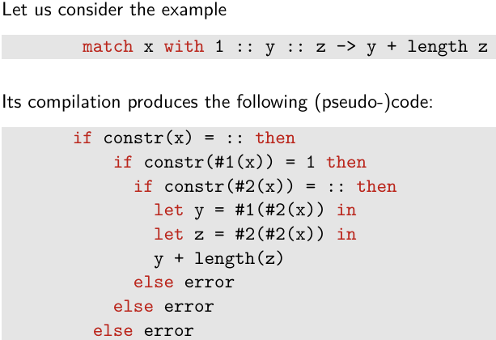

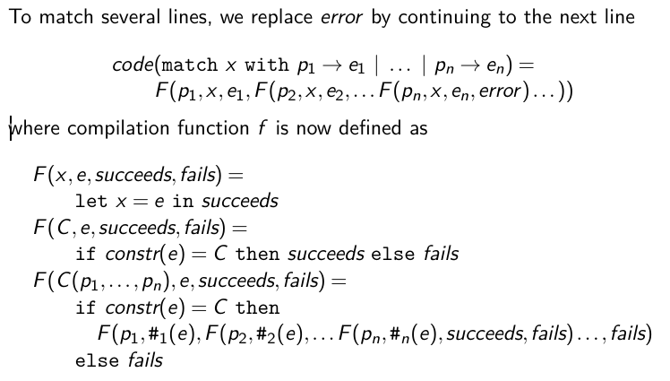

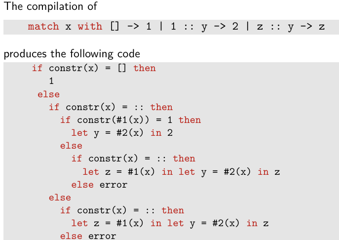

- Matrix solution to use on the test:

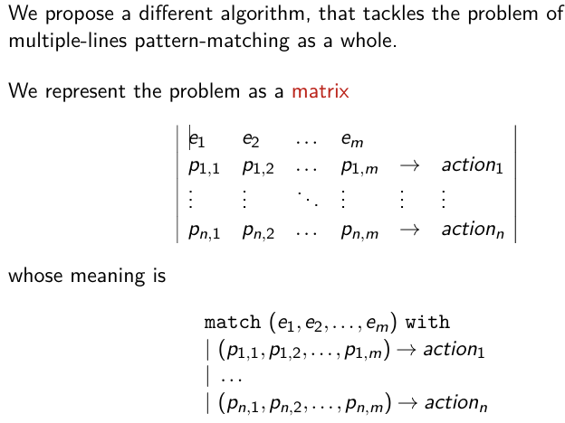

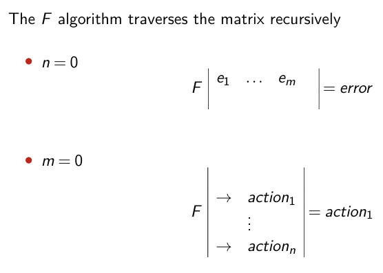

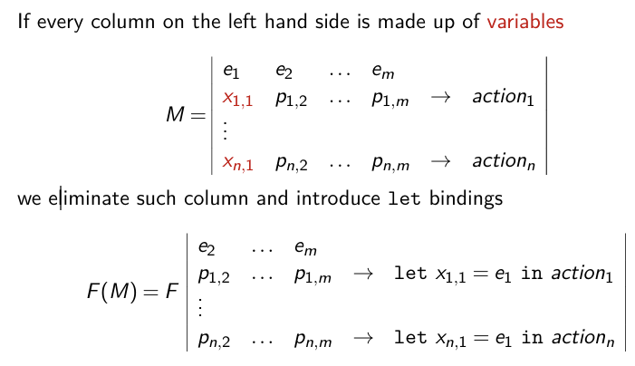

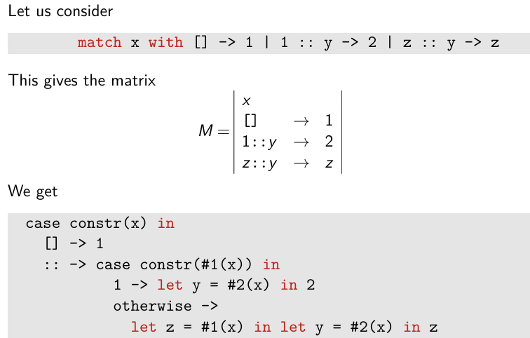

**Closure conversion** is the process of rewriting every nested function into:

1. **A top‐level function definition** (letfun …) that explicitly takes its free variables as extra parameters, and

2. **A clos expression where the original fun appeared**—constructing the closure by packaging a pointer to that top‐level code plus the current values of its free variables.

### 3. A Toy Example: Step‐by‐Step

Before tackling the map/succs program, let’s do a tiny example:

```ocaml
Copy code
let combine x y =
  let f = fun z -> x + z in   (* f closes over x *)
  f y
```

Identify the fun: We see fun z -> x + z.

Compute free variables of its body: In x + z,

**z is bound (parameter).**

**x is free (comes from combine x y).**

No other names appear.
So fv(fun z -> x + z) = { x }.

Lift that fun:

Choose a top‐level code label: say add_env.

Create a top‐level definition:

```ocaml
Copy code
letfun add_env [x] z =
  x + z
```
Replace fun z -> x + z by clos add_env [x] in the body of combine.

Rewrite the whole program:

```ocaml
Copy code
(* Top-level code block for the inner function *)
letfun add_env [x] z =
  x + z

(* The original function now simply builds a closure for add_env *)
let combine x y =
  let f = clos add_env [x] in
  f y
```
Now combine is trivial: it always does clos add_env [x], then immediately calls that closure on y. Under the hood, that call jumps into add_env, passing x as the environment and y as the argument.

Notice how no nested fun remains—we lifted it to add_env.

