# Compilation of Object-oriented Languages - Question 1

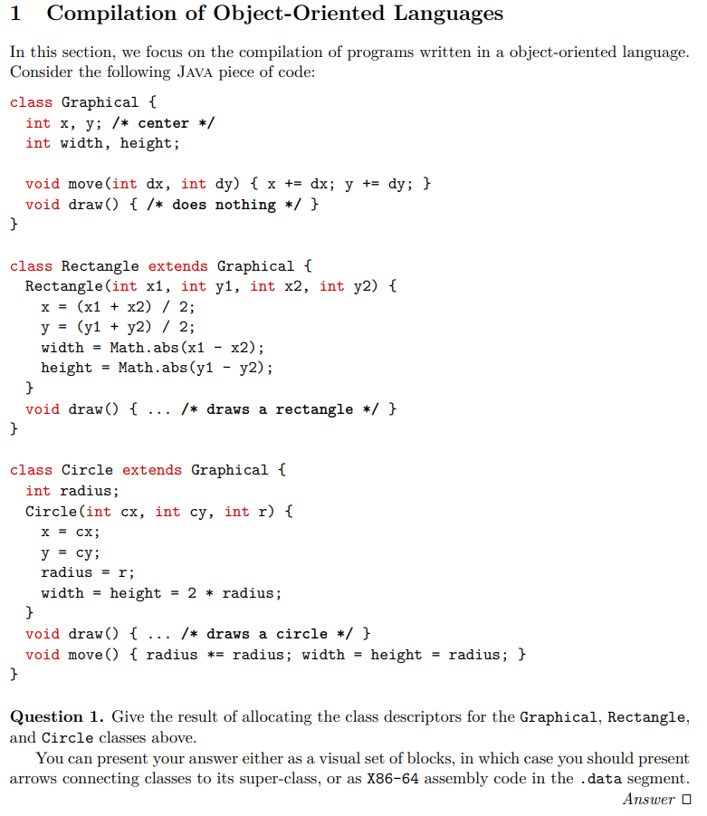

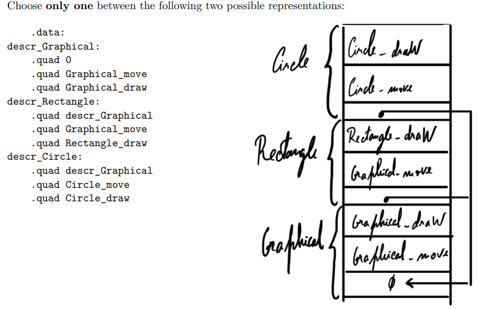

```yaml
    .data
# Descriptor for Graphical (no superclass)
descr_Graphical:
    .quad 0                   # “null” superclass
    .quad Graphical_move      # Graphical::move(int,int)
    .quad Graphical_draw      # Graphical::draw()

# Descriptor for Rectangle extends Graphical
descr_Rectangle:
    .quad descr_Graphical     # pointer to Graphical’s descriptor
    .quad Graphical_move      # inherits move(int,int) with no override
    .quad Rectangle_draw      # overrides draw()

# Descriptor for Circle extends Graphical (but does not override move(int,int))
descr_Circle:
    .quad descr_Graphical     # pointer to Graphical’s descriptor
    .quad Graphical_move      # still uses Graphical::move(int,int)
    .quad Circle_draw         # overrides draw()
    .quad Circle_move         # new zero-arg method Circle.move()
```

# Lesson 10 - Compilation of Functional Languages - Question 2/3

## First-class functions

- First class functions, significa que funções são tratadas como valores, podendo ser passadas como argumentos, retornadas de outras funções, guardadas numa estrutura de dados, construir novas funções dinamicamente, etc.
- Logo, não podemos compilar funções da mesma maneira, porque perdemos o seu contexto.
- A solução é usar um **closure** (fecho), que é uma estrutura de dados heap-allocated (para sobreviver a function calls) que contém:
  - **Um pointer para o código (o body da função)**
  - Os **valores das variáveis livres** que podem ser necessárias por este código, chamado de **environment**.
- The set fv(e) of the free variables of the expression e is computed as follows:


- Uma boa maneira de compilar closures é em dois passos:
  - Primeiro, substituir todas as fun x -> e por construções explicitas de closure, em clos f [y1, ..., yn] , onde yi são as variáveis livres de fun x -> e e f é o nome de uma função global letfun f [y1, ..., yn] x = e', onde e' é derivado de e, by replacing constructions fun recursively (**closure conversion**)
  - Segundo, compilar o código obtido, que só contem declarações de letfun functions.

- Cada função tem um único argumento, passado no registo %rdi, O closure é passado no registo %rsi.
- O stack frame é o seguinte, onde v1,...,vm são as variáveis locais:

## Question 2 - Closure conversion

**Goal** - Transform all function values into explicit closures **(pairs of code pointers and their environment)**, to make all free variables visible at runtime, as required by low-level implementation.

**Steps (direct from lectures & solved examples):**
1. **Identify all function values (lambdas, partial applications, recursive fns).**

2. **Compute free variables for each function (fv(e) formula).**


3. For each function:
  - Create a global function (letfun f [env] x = ...) where [env] are the free variables, and x is the explicit argument.
  - Replace the function value by clos f [actual_env_values].

4. For recursion:
  - The closure environment will often include the function itself.

5. Function application:
  - All function applications become "apply the closure": code pointer is extracted from the closure, and called with the environment.

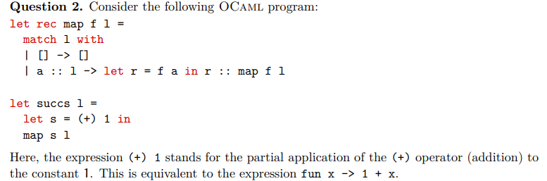

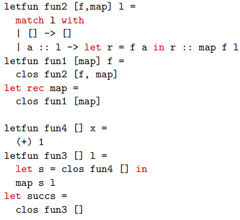


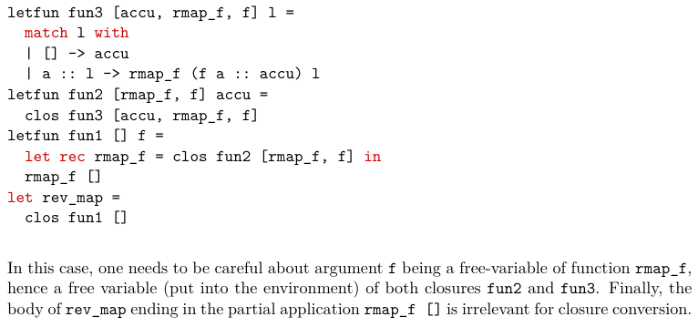

## Question 3 - Compiling pattern-matching expressions (Matrix-based Algorithm)

Pattern Matching	- Build matrix, check first column, variable = let, else case split by constr, recur.

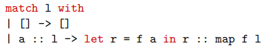

Apresentar a matriz da expressão (M):

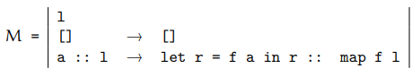

**Algorithm Structure (from class/lectures):**
Given a matrix with patterns in the first column:

- If all entries are variable patterns (not the case here), use let to bind variable and continue to the next column.

- If there are constructor patterns:
  - Partition the rows by constructor for the first column.
  - For each constructor, create a sub-matrix of rows for that constructor, substituting any fields.
  - For each constructor, recursively apply the algorithm to the submatrix.

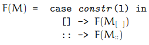

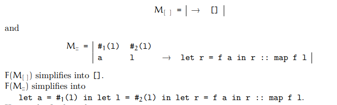


### Continuação da aula


- Para compilar clos f [y1,..., yn] fazemos o seguinte:
  - Alocamos um bloco de tamanho n + 1 no heap com malloc
  - Guardamos o endereço de f no primeiro campo do bloco
  - guardamos os valores de y1,..., yn nos restantes campos do bloco
  - retornamos o ponteiro para o bloco
- Nota: a dealocação do bloco é feita pelo garbage collector.

- Para compilar e1 e2, fazemos:
  - Compilamos e1 para o registo %rsi (o seu valor é um p1 para o closure)
  - Compilamos e2 para o registo %rdi
  - Chamamos a função com o adereço obtido pelo primeiro campo do closure com `call *%rsi` isto é um jump para um endereço dinamico.

- Para compilar o acesso à variável x, distinguimos os 4 casos:
  - **global variable** - o valor é guardado no endereço dado pelo label x
  - **local variable** - o valor está em n(%rbp) / num registo
  - **variable contained in a closure** - o valor está em n(%rsi) / num registo, onde n é o número de variáveis livres antes de x
  - **function argument** - o valor está em %rdi (o primeiro argumento da função)

- Para compilar a declaração letfun f [y1,..., yn] x = e, fazemos:
  - salvar e setar %rbp
  - alocar espaço no stack para as variáveis locais
  - avaliar e no registo %rax
  - apagar o stack frame e restaurar %rbp
  - executar `ret` para retornar o valor no registo %rax

## Tail call optimization


- A **tail call** é uma chamada de função que é a última ação de uma função, ou seja, não há mais código a ser executado após a chamada.

- Nós podemos apagar o stack frame da função que faz a tail call antes de fazer a chamada, porque não precisamos mais dele.
- Melhor, podemos reutilizar para fazer a tail call, em particular o endereço de retorno. **Ou seja, podemos fazer um jump em vez de um call.**

## Pattern-matching

- O objetivo do compilador é transformar instruções de alto nível numa sequência de testes elementares (constructor tests and constants comparison) e aceder aos campos de dados necessários.
- Consideremos a construção `match x with p1 -> e1 | ... | pn -> en`, onde pi são padrões e ei são expressões.
- Um padrão é definido pela sintax abstrata:
- p::= x | C(p,...,p)
- Onde C é um construtor que pode ser:
  - Uma constante
  - Um construtor constante de um tipo algébrico, como [] ou por exemplo, Empty como type t = Empty | ...
  - Um construtor com argumentos como :: ou por exemplo Node as in type t = Node of t * t | ...
  - Um construtor de um n-tuplo com n >=2
- Dizemos que um padrão p é linear se todas as variáveis são usadas no máximo uma vez em p.
- Também se pode incluir padrões em valores: v::=C(v,...,v)
- Dizemos que um valor dá match no padrão p se existir uma substituição σ, de variáveis em valores tal que v = σ(p).


- Matrix solution to use on the test:


# Compilation Schemes, using and creating - Question 4/5

## Question 4


```yaml
    movq $42, %rdi
    movq %rdi, -8(%rbp)
    movq -8(%rbp), %rdi
    testq %rdi, %rdi
    jz L_else
    movq -8(%rbp), %rdi
    pushq %rdi
    movq $10, %rdi
    movq %rdi, %rsi
    popq %rdi
    addq %rsi, %rdi
    movq %rdi, -16(%rbp)
    jmp L_end
L_else:
    movq -8(%rbp), %rdi
    pushq %rdi
    movq $2, %rdi
    movq %rdi, %rsi
    popq %rdi
    addq %rsi, %rdi
    movq %rdi, -24(%rbp)
L_end:

```
## Question 5


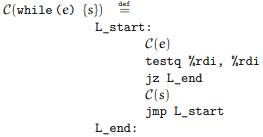

### More possible examples:

A. For Loop - for (x := e1; cond; x := e2) { s }

Equivalent to:

```c
x := e1;
while (cond) {
  s;
  x := e2;
}
```
Schema:

```yaml
C(for (x := e1; cond; x := e2) { s }) ≡
  C(x := e1)
L_start:
  C(cond)
  testq %rdi, %rdi
  jz L_end
  C(s)
  C(x := e2)
  jmp L_start
L_end:
```

B. For-Each Over a List

```c
for x in l do s
```

Equivalent to:

```yaml
C(for x in l do s) ≡
  movq ofs_l(%rbp), %rsi    ; start with list in %rsi
L_start:
  cmpq $0, %rsi             ; test for []
  je L_end
  movq 0(%rsi), %rdi        ; get head (x)
  movq %rdi, ofs_x(%rbp)    ; store x
  C(s)
  movq 8(%rsi), %rsi        ; move to next node (tail)
  jmp L_start
L_end:
```
0(%rsi): head of cons cell, 8(%rsi): pointer to next node.

ofs_x(%rbp): stack offset for x.

C. Tuple Pattern-Matching

```c
let (x, y) = p in s
```
Equivalent to:

```yaml
C(let (x, y) = p in s) ≡
  C(p)                      ; compute tuple, result in %rdi
  movq 0(%rdi), %rsi        ; first element
  movq %rsi, ofs_x(%rbp)
  movq 8(%rdi), %rsi        ; second element
  movq %rsi, ofs_y(%rbp)
  C(s)
```

For triples: also extract 16(%rdi) for z.

Adapt for more elements as needed.

D. Function Definition and Call

Let’s assume a simple convention:

Closures are pointers to code and an environment (you might just store code pointers for simple cases).

Parameters passed in %rdi, return in %rax (or %rdi).

```c
fun f(x) { s }
```
Equivalent to:

```yaml
f:
  pushq %rbp
  movq %rsp, %rbp
  ...    ; allocate locals as needed
  ; x is passed in %rdi, store to ofs_x(%rbp)
  movq %rdi, ofs_x(%rbp)
  C(s)
  popq %rbp
  ret
```

Function call:

```c
y := f(e)
```
Equivalent to:

```yaml
C(e)                       ; compute argument, result in %rdi
call f
movq %rax, ofs_y(%rbp)     ; store result
```

E. Pattern-Matching Over Lists

Suppose:
```c
match l with
| []      -> s1
| x :: xs -> s2
```

Schema:

```yaml	
    C(l)                       ; result in %rdi
    cmpq $0, %rdi              ; test for []
    je L_nil ; cons case:
    movq 0(%rdi), %rsi         ; x = head
    movq %rsi, ofs_x(%rbp)
    movq 8(%rdi), %rsi         ; xs = tail
    movq %rsi, ofs_xs(%rbp)
    C(s2)
    jmp L_end
L_nil:
    C(s1)
L_end:
```

# Production of Efficient Code - Question 6/7

## Question 6


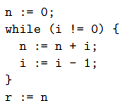

### How to:

**A. Identify Variables and Their Roles**
#1, #2, ..., #7: pseudo-registers.

Look for initialization, update, and loop conditions.

**B. Look for Patterns**
Initialization:
mov 0 #3 means #3 starts at 0 (n := 0)

Loop condition:
The ubranch/jnz at L3 uses #4 to decide which label to go to. #4 is set from #1 (mov #1 #4)

Loop body:

mov #1 #5: copy #1 to #5 (preparing for addition)

binop add #5 #3: #3 := #5 + #3 (i.e., n := n + i)

mov #1 #6, mov 1 #7, binop sub #7 #6, mov #6 #1: sequence for i := i - 1

Loop jump:
goto L2 (loop back)

After loop:
mov #3 #2 (result assignment: r := n)

**C. Structure as High-Level Code**
Initialization before the loop.

Loop condition as the branch.

Loop body: accumulation and decrement.

After loop: assign result.

4. General Method: How to Do This in an Exam
Identify variable initializations (mov const #n): These are high-level assignments.

Find the loop (or conditional) structure:

Repeated jumps, conditional branches, and updates indicate loops.

ubranch or cmp + jz/jnz mean while/if.

Within the loop, find the body:

Look for binop (arithmetic), mov (assignments).

Map to +=, -= etc.

Find what happens after the loop.

Assign meaningful variable names for clarity.

Write the code as if you were the one who wrote it originally, not the compiler!

| RTL Pattern            | WHILE/C equivalent       | How to spot it          |
| ---------------------- | ------------------------ | ----------------------- |
| `mov 0 #n`             | `n := 0;`                | constant init           |
| `ubranch jnz #v`       | `while (v != 0) { ... }` | conditional branch/jump |
| `binop add #a #b`      | `b := b + a;`            | addition                |
| `binop sub #a #b`      | `b := b - a;`            | subtraction             |
| `mov #a #b`            | `b := a;`                | assignment              |
| `goto` (back to start) | (end of while)           | loop back               |
| `mov #n #result`       | `result := n;`           | result assignment       |

### Possible variants:

**A. Arithmetic For Loop**

WHILE/C Code

```c
sum := 0;
for (i := 1; i <= N; i := i + 1) {
    sum := sum + i;
}
```

Corresponding RTL

```yaml
L1: mov 0 #1           ; sum := 0
L2: mov 1 #2           ; i := 1
L3: mov #2 #3
    cmp #3, #N
    jg  L_end
L4: mov #2 #4
    add #1 #4          ; #4 = sum + i
    mov #4 #1          ; sum := #4
L5: add 1 #2           ; i := i + 1
    jmp L3
L_end:
```

**B. For-Each Loop Over a List**

WHILE/C Code

```c
s := 0;
while (l != []) {
    s := s + head(l);
    l := tail(l);
}
```

Possible RTL

```yaml
L1: mov 0 #1           ; s := 0
L2: mov l #2           ; #2 = l
L3: cmp #2, []         ; check if list is empty
    je L_end
L4: head #2 #3         ; #3 = head(l)
    add #1 #3          ; #3 = s + head(l)
    mov #3 #1          ; s := #3
    tail #2 #2         ; l := tail(l)
    jmp L3
L_end:
```

- Note: head/tail are pseudo-instructions for accessing list fields.

**C. Pattern-Matching on Tuples**

WHILE/C Code

```c
(x, y) := t;
z := x + y;
```

Possible RTL

```yaml
L1: mov t #1           ; #1 = t
L2: fst #1 #2          ; #2 = x = first element
L3: snd #1 #3          ; #3 = y = second element
L4: add #2 #3          ; #3 = x + y
L5: mov #3 #4          ; z := #3
```

- Note: fst/snd = pseudo-instructions for extracting tuple elements.

**D. Function Call (No Closures)**

WHILE/C Code

```c
y := f(x);
```
Possible RTL
```yaml
L1: mov x #1           ; #1 = x (argument)
L2: call f, #1, #2     ; call f with #1, result in #2
L3: mov #2 #y          ; y := #2
```

- Note: Here, call f, #1, #2 is a pseudo-instruction.

**E. Pattern-Matching on a List**

WHILE/C Code

```c
if (l == []) {
    z := 0;
} else {
    z := head(l);
}
```

Possible RTL

```yaml
L1: mov l #1
    cmp #1, []
    je L2
L3: head #1 #2
    mov #2 #z
    jmp L_end
L2: mov 0 #z
L_end:
```

**F. For Loop with Tuple Accumulator**

WHILE/C Code

```c
(a, b) := (0, 0);
for (i := 1; i <= N; i := i + 1) {
    a := a + i;
    b := b + 2 * i;
}
```

Possible RTL

```yaml
L1: mov 0 #1           ; a := 0
    mov 0 #2           ; b := 0
L2: mov 1 #3           ; i := 1
L3: cmp #3, #N
    jg L_end
L4: add #1 #3          ; #1 = a + i
    mov #1 #1          ; a := #1
    mul 2 #3           ; #4 = 2 * i
    add #2 #4          ; #2 = b + (2*i)
    mov #2 #2          ; b := #2
    add 1 #3           ; i := i + 1
    jmp L3
L_end:
```

## Interference Graphs - Question 7 Aula 11/12

1. The interference graph is an undirected graph where:
- Each node is a pseudo-register (e.g., #1, #2, ...).
- An edge between nodes means those two pseudo-registers are live at the same time (their values are needed simultaneously), so they cannot be stored in the same physical register.
- There are also “preference” (dashed) edges, usually for mov operations, where it's desirable (but not necessary) to put both in the same register to eliminate unnecessary moves.

2. How to Build It (Step by Step)

**A. Perform Liveness Analysis**
For every instruction, compute which pseudo-registers are live "out" **(needed after the instruction)**.

See lecture for the equations:

```sql
in(l) = use(l) ∪ (out(l) \ def(l))
out(l) = ⋃ [in(s) for each successor s]
```


**def(l)** = registers written (assigned) in the instruction at label l

**use(l)** = registers read (used) in the instruction


For each instruction that defines a register v, draw an edge from v to every other register w live in out(l) (except for moves, see below).

**B. Special Case: mov Instructions**
For mov w v, do not create an interference edge between w and v, but instead draw a dashed “preference” edge, meaning it’s preferable (but not necessary) to allocate them to the same register.

### Example

```yaml
L1:   mov 0 #3         → L2
L2:   mov #1 #4        → L3
L3:   ubranch jnz #4   → L4, L11
L4:   mov #1 #5        → L5
L5:   binop add #5 #3  → L6
L6:   mov #1 #6        → L7
L7:   mov 1 #7         → L8
L8:   binop sub #7 #6  → L9
L9:   mov #6 #1        → L10
L10:  goto             → L2
L11:  mov #3 #2        → L12
L12:  (end)
```
2. Def/Use Table

| Label | Instruction     | Def | Use    | Succ    |
| ----- | --------------- | --- | ------ | ------- |
| L1    | mov 0 #3        | #3  | —      | L2      |
| L2    | mov #1 #4       | #4  | #1     | L3      |
| L3    | ubranch jnz #4  | —   | #4     | L4, L11 |
| L4    | mov #1 #5       | #5  | #1     | L5      |
| L5    | binop add #5 #3 | #3  | #5, #3 | L6      |
| L6    | mov #1 #6       | #6  | #1     | L7      |
| L7    | mov 1 #7        | #7  | —      | L8      |
| L8    | binop sub #7 #6 | #6  | #7, #6 | L9      |
| L9    | mov #6 #1       | #1  | #6     | L10     |
| L10   | goto            | —   | —      | L2      |
| L11   | mov #3 #2       | #2  | #3     | L12     |
| L12   | (end)           | —   | —      | —       |

3. Compute Liveness: in and out for Each Label

We'll fill this in backwards from L12 to L1.

Initialize:
out(L12) = ∅, in(L12) = ∅

| Label | def | use    | out                                        | in                   |
| ----- | --- | ------ | ------------------------------------------ | -------------------- |
| L12   | —   | —      | ∅                                          | ∅                    |
| L11   | #2  | #3     | ∅                                          | {#3}                 |
| L10   | —   | —      | {#1, #4}                                   | {#1, #4}             |
| L9    | #1  | #6     | {#1, #4}                                   | {#6, #4}             |
| L8    | #6  | #7, #6 | {#1, #4}                                   | {#7, #6, #4}         |
| L7    | #7  | —      | {#7, #6, #4}                               | {#6, #4}             |
| L6    | #6  | #1     | {#7, #6, #4}                               | {#1, #7, #4}         |
| L5    | #3  | #5, #3 | {#1, #7, #4}                               | {#5, #3, #1, #7, #4} |
| L4    | #5  | #1     | {#5, #3, #1, #7, #4}                       | {#1, #3, #7, #4}     |
| L3    | —   | #4     | {#1, #3, #7, #4} ∪ {#3} = {#1, #3, #4, #7} | {#4, #1, #3, #7}     |
| L2    | #4  | #1     | {#4, #1, #3, #7}                           | {#1, #3, #7}         |
| L1    | #3  | —      | {#1, #3, #7}                               | {#3, #1, #7}         |

Explanation for a couple tricky points:

L10: Successor is L2; in(L2) = {#1, #3, #7}; so out(L10) = {#1, #4} (from path via goto loop).

L3: Successors are L4 (in(L4) = {#1, #3, #7, #4}) and L11 (in(L11) = {#3}). So out(L3) = union = {#1, #3, #4, #7}.

You might find small differences depending on how you resolve union points, but this is the main structure.

4. Build the Interference Graph

L1: mov 0 #3 → L2
def = #3, out = {#1, #3, #7}

mov: add dashed #3--0 (0 is not a pseudo-register, so no effect)

Interference: #3 -- #1, #3 -- #7 (do not do #3--#3).

L2: mov #1 #4 → L3
def = #4, out = {#1, #3, #7}

mov: dashed #1--#4

Interference: #4 -- #3, #4 -- #7 (not #4--#1 because mov)

L3: ubranch jnz #4 → L4, L11
def = none

(no new edges)

L4: mov #1 #5 → L5
def = #5, out = {#1, #3, #7, #4}

mov: dashed #1--#5

Interference: #5 -- #3, #5 -- #7, #5 -- #4

L5: binop add #5 #3 → L6
def = #3, out = {#1, #7, #4}

binop: interference #3 -- #1, #3 -- #7, #3 -- #4

L6: mov #1 #6 → L7
def = #6, out = {#7, #6, #4}

mov: dashed #1--#6

Interference: #6 -- #7, #6 -- #4

L7: mov 1 #7 → L8
def = #7, out = {#7, #6, #4}

mov: dashed #1--#7 (not present, since src is constant)

Interference: #7 -- #6, #7 -- #4

L8: binop sub #7 #6 → L9
def = #6, out = {#1, #4}

binop: #6 -- #1, #6 -- #4

L9: mov #6 #1 → L10
def = #1, out = {#1, #4}

mov: dashed #6--#1

Interference: #1 -- #4

L10: goto → L2
no def, skip.

L11: mov #3 #2 → L12
def = #2, out = ∅

mov: dashed #3--#2

(no out to add interference)

## Optimizable instructions 

| Operation  | Optimized Instruction / Trick |
| ---------- | ----------------------------- |
| x + 1      | `incq`                        |
| x - 1      | `decq`                        |
| x + 0      | *(skip)*                      |
| x - 0      | *(skip)*                      |
| x \* 0     | `xorq reg, reg`               |
| x \* 1     | *(skip)*                      |
| x \* 2^n   | `shlq $n, reg`                |
| x \* -1    | `negq reg`                    |
| x / 1      | *(skip)*                      |
| x / 2^n    | `sarq $n, reg`                |
| x := x + y | `addq src, dst`               |
| x := x - y | `subq src, dst`               |

