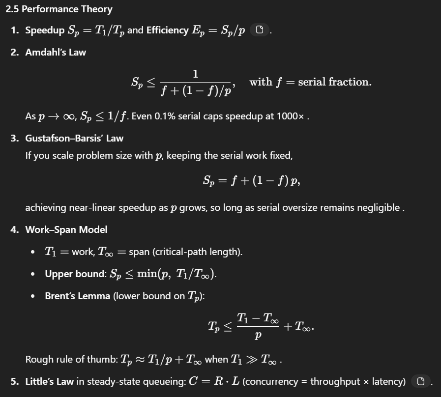
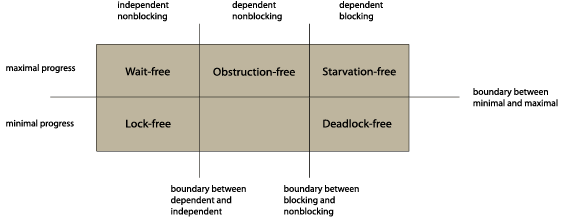
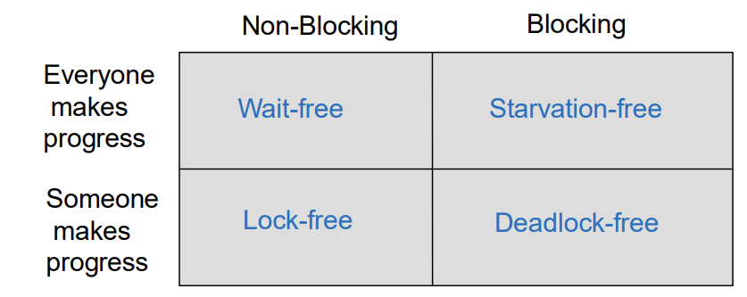

# Estudo T1

## Parallel Programming Models & Architectures

### Why CP? 

- Efficient resource utilization, responsiveness, Emerging workloads, Performance & speedup, scalability, better software design.

- Parallelism - doing many things at the same time.
- Concurrency - structuring a program as multiple tasks that can overlap in time - even if on one core, via interleaving or time-slicing.

### Flynn's Taxonomy

|                          | Single Data       | Multiple Data                    |
| ------------------------ | ----------------- | -------------------------------- |
| **Single Instruction**   | SISD (scalar CPU) | SIMD (vector units, GPUs)        |
| **Multiple Instruction** | MISD (rare)       | MIMD (multi-core CPU, clusters)  |

- SMP (Shared-Memory) - all cores see one address space.
- NUMA - memory access time varies by core.
- Clusters (distributed-memory MIMD) - nodes communicate via networks.

- Span - time to execute the critical path of a parallel program.
- Work - total task count or time if executed serially.

- Ahmdal's law, Gustafson's law, work span model, etc. 

## Mutual Exclusion

A lock must satisfy:
- Mutual exclusion: only one thread can hold the lock at a time.
- Deadlock-freedom - if a thread calls lock() or unlock(), eventually **some** thread completes its call. (system-wide progress guarantee).
- Starvation-freedom - every thread's lock()/unlock() eventually returns (thread-level progress guarantee).
- Bounded waiting (fairness) - no thread waits indefinitely for the lock.

## Concurrent Objects

### Correctness Criteria

#### Sequential Specification

- Every object has a sequential specification: a set of legal sequential histories that define its behavior.
- In effect, if you ran the methods one at a time, in program order, you'd get exactly the same results as if you ran them concurrently.

### Sequential Consistency

- safety aka correctness
- liveness aka progress

- Sequential consistency requires that a concurrent history be equivalent to some legal sequential history that respects program order on each thread and meets the object's sequential specification.

- Principles:
1. Method calls must appear to take effect in program order.
2. There exists a single total order of all calls that respects each thread's program order and the spec.

- Nonblocking: For any pending invocation there is always some legal response you could return immediately without violating the sequential specification.
- Caveat: Real-time order need not be preserved. Two non-overlapping calls on different threads may be reordered in the total order.
- Not compositional: If two objects are sequentially consistent, their composition does not guarantee sequential consistency.

### Linearizability

- Each method call should appear to take effect instantaneously at some moment between its invocation and response.

- This principle states that the **real-time order of method calls must be preserved**. we call this correctness condition linearizability. 
- **EVERY LINEARIZABLE EXECUTION IS SEQUENTIALLY CONSISTENT, BUT NOT VICE VERSA.**

- Compositional, Nonblocking.

#### Linearization points

- A linearization point is a moment in time when a method call appears to take effect instantaneously.
- For lock-based implementations, the linearization point is any point within the critical section.
- For implementations that don't use locks, the linearization point is typically a single step where the effects of the method call become visible to other method calls.

- For example, in the single-enqueuer/single-dequeuer queue, the linearization point for dequeue, it is when the item is when the head field is updated. if the queue is empty the deq method is linearized when it reads the tail field.

### Quiescent Consistency

- Quiescent consistency is a weaker condition than linearizability, allowing for more flexibility in concurrent executions.
- One way to relax consistency is to enforce ordering only when an objecti is quiescent, that is, when it has no pending method calls.

- Principle: Method calls seperated by a period  of quiescence should appear to take effect in their real-time order.

### Progress Conditions

**Wait-freedom**: a method of an object is wait-free if every call finishes its execution in a finite number of steps.

**Lock-freedom**: Every thread that takes steps makes progress. (at least one thread makes progress). Admits that some threads might starve.

Obstruction-freedom: Every thread that executes in isolation makes progress. (if no other threads are running, the thread will complete its operation).

## Foundations of shared memory

- Safe registers are quite unsafe.
- A SRSW or MRSW is **safe** if:
- A read call that does not overlap a write call returns the value written by the most recent write.
- A read that overlaps a write can return anything.

- Regular register is an SRSW or MRSW register where writes do not happen atomically.
- Suppose a read call overlaps with write calls, then the read can return the previous value or the value written by any of the overlapping writes.

- Atomic registers guarantee that reads and writes happen atomically.

- Atomic snapshot is an array of MRSW registers written by different threads that can be read atomically by any thread. 

---
Oject projections, thread projections, Complete subhistory, Sequential histories, Well-formed histories, Equivalent subhistories.

Sequential consistency

- Progress Conditions:
  - Deadlock-Free: System-wide progress guarantee.
  - Starvation-Free: Thread-level progress guarantee.
  - Lock-Free: Some thread always makes progress.
  - Wait-Free: Every thread always makes progress, no matter the state of other threads.

Ver registers e atomic snapshot.
