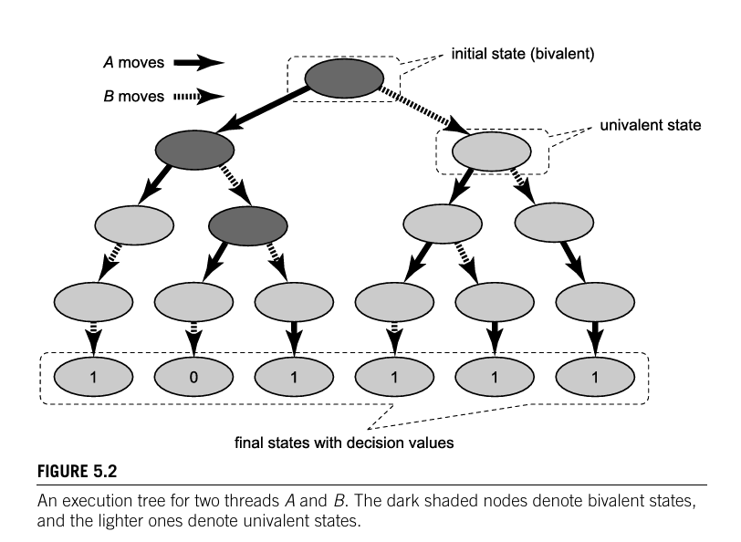
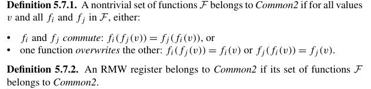

# Estudo T2

## The relative power of primitive synchronization operations

**consensus number**: the maximum number of threads for which objects of the class can solve an elemntary synchronization problem called consensus.

- In a system of n or more concurrent threads, it is impossible to implement a wait-free or lock-free object with consensus number n from objects with a lower consensus number.

### Consensus numbers

- Consensus is an innocuous-looking, somewhat abstract problem that has enormous consequences for everything from algorithm design to hardware architecture.
- A consensus object provides a single method decide().
- Each thread calls the decide method with its input v at most once, the object's decide() method returns a value meeting the following conditions:

- **consistent**: all threads decide the same value,
- **valid**: the common decision value is some thread's input.

- **consensus protocol** is any class that implements consensus in a wait-free manner.

- **A class C solves n-thread consensus if there exists a consensus protocol for n threads iusing any number of objects of class C and any number of atomic registers.**

- The consensus number of a class C is the largest n for which that
 class solves n-thread consensus. If no largest n exists, we say the consensus number
 of the class is infinite.

 - Suppose one can implement an object of class C from one or more
 objects of class D, together with some number of atomic registers. If class C solves n-consensus, then so does class D.

###  States and valence

- A move is a method call to a shared object.
- An initial state is a protocol state before any threads has moved.
- A final state is a protocol after all threads have finished.
- The decision value of any final state is the value decided by all threads in that state.

- A wait-free protocol's set of possible states forms a tree, where each node is a possible protocol state and each edge a possible move. 
- An edge for A from node s to node s' means that s' is a successor state to s. 
- A protocol is bivalent if the decision value is not yet fixed: There is some execution that leds to the threads deciding 0 and one in which they decide 1.
- 0/1-valent if the decision value is fixed to 0 or 1, respectively.

- Every two-thread consensus protocol has a bivalent initial state.

- A protocol state is critical if it is bivalent and if any thread moves, the protocol state becomes univalent.

- Every wait-free consensus protocol has a critical state.

### Atomic registers

Atomic registers have consensus number one, meaning they can only solve consensus for one thread.

### FIFO queues

- FIFO queues have consensus number two, meaning they can solve consensus for two threads.

### Multiple Assignment objects

- There is no wait-free implementation of an (m,n)-assignment object by atomic registers for any n > m > 1.

- (n, (n(n+1))/2)-assignment for n>1 has consensus number at least n.

### Read-modify-write operations

- AtomicInteger, is a class with a rich set of RMW methods.

- getAndSet(v): sets the value to v and returns the previous value. RMW method for the set of constant functions of type fv(x) = v.
- etc.

- A set of functions is nontrivial if it includes at least one function that is not the identity function.

- **Any nontrivial RMW register has consensus number at least two.**

### Common2 RMW operations

- Common2 is a class of RMW registers that correspond to many of the common synchronization primitives provided by processor in the late 20th century. Although these registers are more powerful than atomic registers, we show that they have consensus number exactly two, implying that they have limited synchronization power.

Any RMW register in Common2 has consensus number 2.

### cas operation

- compareAndSet and get methods has an infinite consensus number.

- also has infinite consensus number: memory-to-memory move, load-linked/store-conditional.

## Universitality of consensus

- A class is universal in a system of n threads if and only if it has a consensus number greater than or equal to n.

- Each object has an apply method that takes an invocation which describes the method being called and its arguments, and returns a response that describes the result of the method call.

- A log is a linked list of nodes representing the sequence of method calls applied to the object (sequence of state transitions).
- Only the head of the log is mutable: the initial state and nodes preceding the head never change.
- How can we allow threads to make concurrent calls to the apply method? 

### Wait-free variation

- Uses a helping mechanism to ensure that every thread can complete its apply method in a finite number of steps. using an announce array, where each thread annouces its node in the log, at stays until ur node is inserted by u or another thread, using round-robin scheduling.

- start(A): The sequence number of the log-head snapshot when A first announces its node.
- concur(A): the set of distinct nodes that have been inserted into any head[]slot after A's announcement.

- every thread completes its apply in at most n + 1 iterations of the main loop - hende wait-free.

## Spin locks and contention

- There's two alternatives for when you can't acquire a lock:
- **Spin**: repeatedly try to acquire the lock until you succeed. 
    - lock expected to be held for a short time.
- **Block**: wait until the lock is available, which may involve sleeping. 
    - lock expected to be held for a long time.

- The TASLock performs so poorly because it keeps trying to set the lock after a cache miss, which is very expensive.
- The TTASLock improves on this by using a test-and-test-and-set approach, which reduces the number of cache misses by keeping the thread reading from the cache until it's a cache miss, at which point it tries to set the lock.

- Contention on a lock occurs when multiple threads try to acquire the lock at the same time.

- Whenever a thread sees the lock has become free but fails to acquire it, it backs off before retrying.
- A good rule of thumb is to back off exponentially, doubling the backoff time each time you fail to acquire the lock.

- One drawback of backoff is that it underutiulizes the critical section when the lock is contended, as threads spend time backing off instead of trying to acquire the lock, and this can be unfair. 

### Queue Locks

#### Array-based Queue Locks

require an array size >= maximum concurrent threads. Provides FIFO with no starvation, can happen false sharing that can be eliminated with padding.

#### CLH Queue lock

- Do a CAS on the tail to link the node at the end and spin on the predecessor's locked flag, when that goes to false, its your turn.

- Provides more scalability, only one node per thread, FIFO order starvation-free, with NUMA-friendliness since we spin on our own node's cache line.

#### MCS Queue lock

- Similar to CLH, but with an explicit linked list, each node has both next and locked fields, and the queue is embodied in the nodes themselves.
- If there's a predecessor, set its own locked to true and our node, then spin on its own locked.
- The unlocker either hands off direct to its successor by setting its locked to false, or if none, resets the queue to empty.

- Each thread spins on its own node's locked field.

### Queue lock with timeouts

- tryLock: allows the caller to specify a timeout, that is the maximum duration the caller is willing to wait for the lock. 

### Hierarchical locks

- since in NUMA, passing a lock between threads in different clusters (remote threads) incurs a significantyly more overhead than passing it between threads in the same cluster (local threads), we can prefer to pass locks between threads in the same cluster.

- If this is too successful at passing the lock among threads in the same cluster, it can lead to starvation of threads in other clusters.

### Cohort locks

- lock cohort, is a simple but efficient technique that enables threads in a cluster to pass the lock among themselves without inter-cluster communication. 
- The set of threads in a singles cluster waiting to acquire a lock is called a **cohort**.
- In a cohort lock, each cluster has a cluster lock, held by a thread, and the clusters share a global lock, held by a cluster. 
- When releasing the cohort lock, the thread checks wheter there is any thread in the cohort that is waiting, if so it releases the cluster lock withtout releasing the global lock.
- To prevent remote threads from starving, a cohort lock must have some policy that restricts threads from passing the lock among themselves indefinitely without releasing the global lock.

- A lock is thread-oblivious if the thread releasing a thread-oblivious lock need not be the thread that most recently acquired it.

### a composite lock

- We basically keep a fixed-size queue of at most L threads for the front line and let other contenders back off until a slot opens in that short queue. 

- Fast hand-off for the small queued cohort.
- Adaptive back-off for the rest (they don't hammer the bus, and they can time out immediately)
- O(L)

## Monitors and blocking synchronization

### Conditions

- signal wakes up one thread waiting on a condition
- signalAll wakes up all waiting threads.
- the thread holding the lock can use an await operation to release the lock and suspend itself, giving another thread the opportunity to acquire the lock.

A thread that is holding a reentrant lock can acquire it again without blocking.

### Readers-writers locks

- No thread can acquire the write lock while any thread holds either the write lock or the read lock.
- No thread can acquire the read lock while any thread holds the write lock.

### FIFO read-writer locks

- Ensures that once a writer calls the write lock's lock method, no more readers will acquire the read lock until the writer has acrquired and released the write lock, prioritizing writers over readers.

## Linked lists: the role of locking

- Coarse grained synchronization: if a class uses a single lock to mediate all its method calls, is not always scalable, even if the lock itself is scalable. 
- This works if not many threads are contending the object.

- This chapter introduces several useful techniques for fine grained synchronization.

### Fine-grained synchronization

- **Fine grained synchronization**: instead of using a single lock to synchronize every access to an object, we partition the object into independently synchronized components, allowing method calls that access disjoint components to execute concurrently.

- **hand-over-hand locking** - aka lock coupling - is a technique that allows multiple threads to traverse and modify disjoint parts of the structure concurrently.
- Basically we acquire the lock on the next node before releasing the lock on the current node, so that we always hold a lock on the next node while traversing the list, ensuring that the list is always consistent. No torn updates, and safe traversal and modification.

### Optimistic synchronization

- **Optimistic synchronization**: many objects, consist of multiple components linked together by references. Some methods search for a particular component. One way to reduce the cost of fine-grained synchronization is to search without acquiring any locks at all. If the method finds the sought-after component, it locks that component, and then checks if that component has not changed in the interval between the search and the lock acquisition. This is worthwhile if it succeeds more often than not.

Is not starvation-free, since a thread might  be delayed indefinitely if new nodes are repeatedly added and removed.

### Lazy synchronization

- **Lazy synchronization**: somethimes it makes sense to postpone hard work. For example, the task of removing a component from a data structure can be split into two phases: The component is logically removed simply by setting a flag bit, and later the component is physically removed by unlinking it from the rest of the data structure.

One drawback of the optimistic algorithm is that contains acquiered locks, which is unattractive since contains calls are typically much more common than call to other methods.
We can make contains wait-free and add and remove, while still blocking, traverse the list only once (in the absence of contention).

add and remove are not starvation-free, because list traversals may be arbitrarily delayed by ongoing modifications.

A principal distadvantage of lazy list algorithm is that add and remove calls are blocking, if one thread is delayed, then others may also be delayed.

### Nonblocking synchronization

- **Nonblocking synchronization**: Sometimes we can eliminate locks entirely, relying on built-in atomic operations such as compareAndSet() for synchronization.

- Using AtomicMarkableReference (encapsulates a reference and a boolean mark) the compareAndSet() method tests the expected reference and mark values, in order to make changes.

## Data Races

### Low-level data races

- Two threads access the same shared variable, at least one is a write, and there is no synchronization ordering those accesses.

- Happens-before relationship.

### The Lock-Set (Eraser) Algorithm

- Goal: infer which locks protect each variable by watching actual runs.
- Per-thread state: LocksHeld(t): locks currently owned by thread t.
- Per-variable state: LockSet(v): candidate locks that have always been held when v was accessed so far. 
- Update rules:
    - On lock(l)/unlock(l): add/remove l in LocksHeld(t).
    on t's access to v: LockSet(v) = LockSet(v) ∩ LocksHeld(t). if LockSet(v) is empty, then v warn a potential data race on v.

- Refinements (to reduce false positives):
    - Initialization: skip refinement until v is accessed by a second thread.
    - Read-only sharing: do not warn if only reads so far.
    - Read-write locks: on writes intersect with write-mode locks only.

- Eraser is imp+lemented by binary rewriting (ATOM) and tracks one 32-bit word at a time, using a shadow memory word to store each variable's 2-bit state + 30 bit lock-set index.

- Warnings do not imply a data race, just a bad locking discipline.

### High-level data races (View consistency)

- Lá porque os teus acessos n deram barraca, n significa que não há.
- criamos um ASM (autonoma) do programa, se ele n obedecer, deu merda.
- Vamos à pastelaria comprar bolo mas quero contribuinte na fatura, no entanto a pastelaria fechou à 2 semanas, como o bolo mas n é declarado, na prática comi o bolo e tass bem, na teórica, n é consistente.

- Even with all fields individually protected, a programmer may expect multiple fields to be accessed as an atomic tuple. Non-atomic partial accesses can corrupt invariants.

- Two threads have a high-level data race on lock l if they generate overlapping but incomparable maximal views under l (neither is a subset of the other, yet their intersection is non-empty).

### State-Value (Privatization) Errors

- Privatization: a thread reads a shared variable (after locking) into a local copy, then releases the lock and uses the local value.
- State-value race: if another thread modifies the shared variable after the lock is released but before the local use, the first thread works on an out-of-date value.

### Takeaways

- Always synchronize every shared-variable access and consider whether multiple fields need to be grouped under one lock.
- Use Eraser to catch traditional races via the lock-stet refinement.
- Augment with high-level-race detector to find inconsistent tuple accesses.
- Watch for privatization bugs by ensuring no unprotected use of locally cached shared data.

