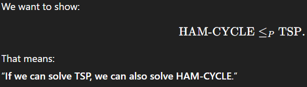
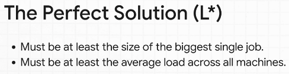

# Chapter 1 - Introduction to Theory of Complexity

## Basic Notions

### Problem, instance and solution

- Hamiltonian Cycle Problem (HAM-Cycle) - Given an undirected graph G, does it contain a Hamiltonian cycle (a simple cycle that visits every vertex exactly once)?

- Traveling Salesman Problem (TSP) - Given a complete undirected graph G with nonnegative weights on the edges and a positive integer k, does G contain a Hamiltonian cycle of weight at most k?

- Minimum Travelling Salesman Problem (Min-TSP) - Given a complete undirected graph G with nonnegative weights on the edges, find a Hamiltonian cycle of minimum weight.

### Decision & Optimization Problems

- A decision problem is a problem with a yes/no answer.
- An optimization problem is a problem where any solution has the "best value".

### Some Complexity Classes

- P: Decision problems that are solvable in polynomial time.
- NP: Decision problems that are solvable in non-deterministic polynomial time or, more intuitively, that are **verifiable** in polynomial time.
- EXP: decision problems that are solvable in exponential time.

A problem is said to be:
- Tractable - if there is a polynomial time algorithm that solves it.
- Intractable - if (it has been proved that) there is no polynomial time algorithm that solves it.

NP Problems - Finding is hard, but checking is easy. So, since we can't solve perfectly, we approximate to get a fast solution with a provable quality.

### Polynomial-time reductions

A problem X is reducible to a problem Y if there is a function f that transforms every instance I of X into an instance f(I) of Y such that:

f: X -> Y
   I -> f(I)

- SolutionX(I) = SolutionY(f(I))

A problem Y is NP-hard if every problem X in NP is reducible to Y.
Y is at least as hard as the problems in NP.

A problem is NP-complete if Y is NP-hard and Y is in NP.
Y is among the hardest problems in NP.

## Approximation Algorithms 

- Approximation Ratio - An algorithm A for a minimization problem has an approximation ratio of ρ(n) if, for any input of size n, the cost C of the solution produced by A and the cost C* of an optimal solution satisfy the inequality:

C / C* ≤ ρ(n)

- As closer to 1, better the approximation.
- Such algorithms are called ρ(n)-approximation algorithms.

- We need to prove that a solution's value v is close to the optimum value v* even without knowing v*.

