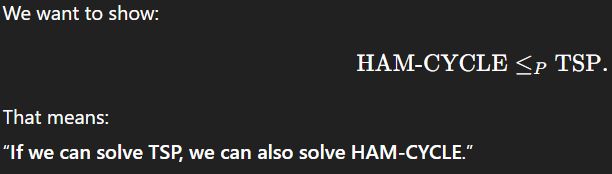
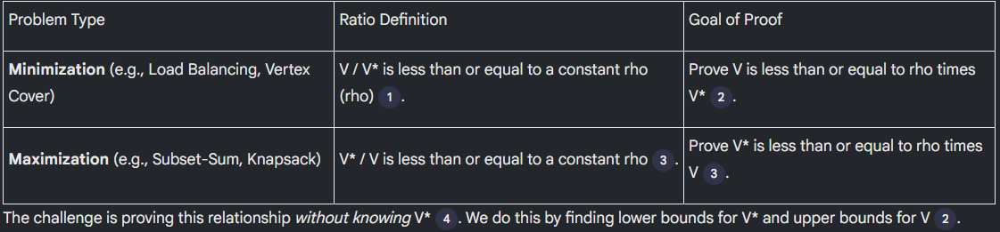
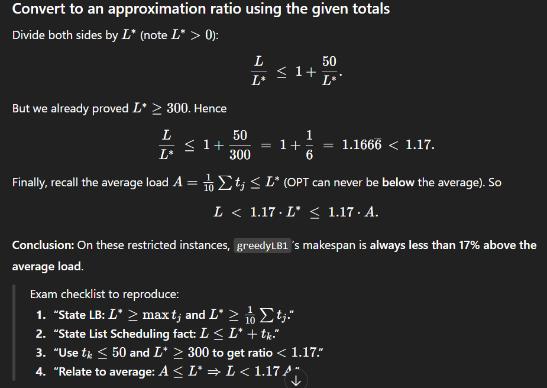
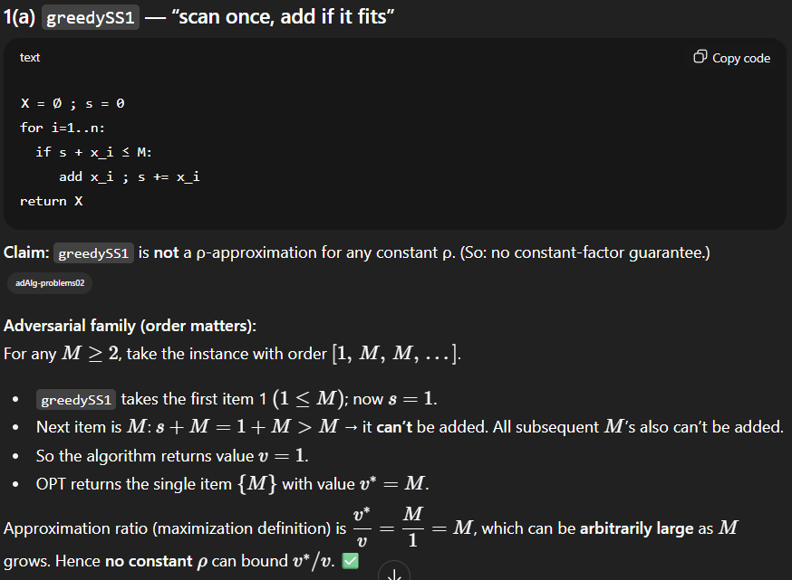
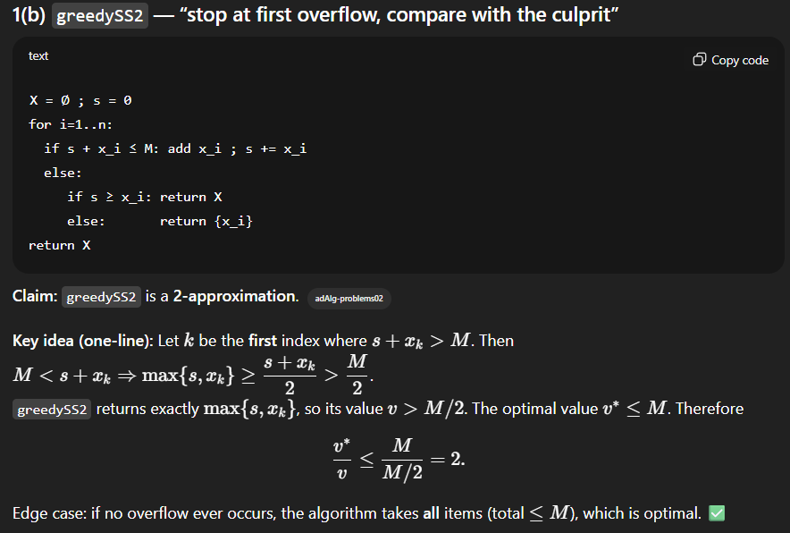
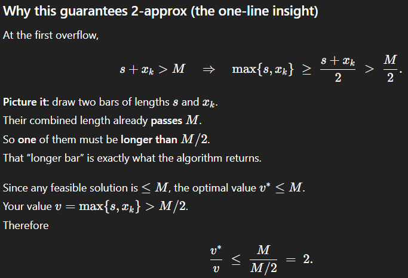
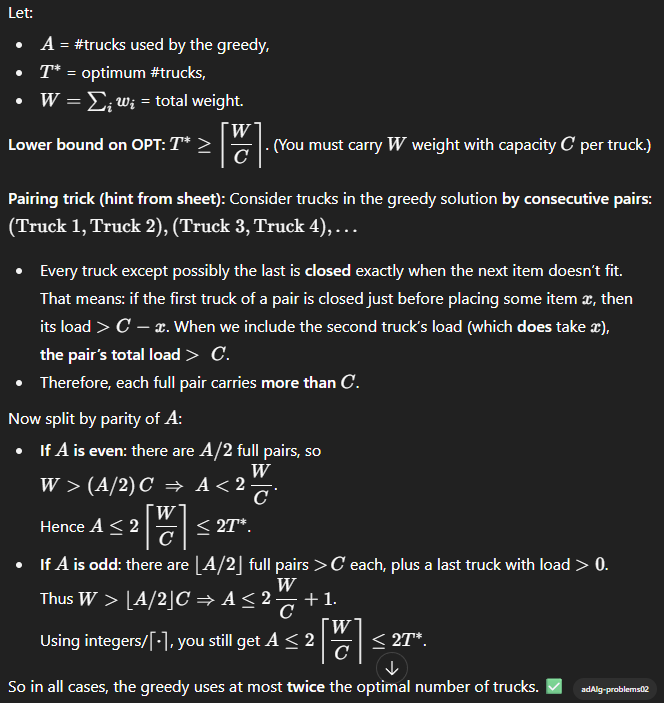
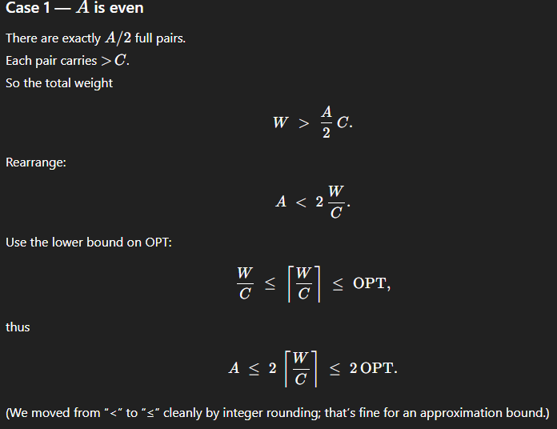
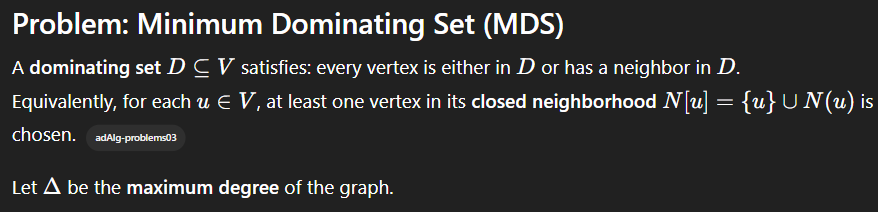

# ADV. ALGO Test study

## 🧭 1. Complexity & Reduction Fundamentals

### **1.1 Complexity Classes**

| Symbol          | Meaning                                                               |
| --------------- | --------------------------------------------------------------------- |
| **P**           | Problems solvable in polynomial time                                  |
| **NP**          | Problems whose solutions can be *verified* in polynomial time         |
| **NP-hard**     | At least as hard as every problem in NP (no known polytime algorithm) |
| **NP-complete** | Problems that are both NP-hard and in NP                              |

---

### **1.3 Approximation Definitions**

* For **minimization problems**:
  $$
  \frac{ALG(I)}{OPT(I)} \le \rho
  $$

* For **maximization problems**:
  $$
  \frac{OPT(I)}{ALG(I)} \le \rho
  $$

where $\rho \ge 1$ is the **approximation factor**.

---

### **1.4 General proof pattern (minimization)**

1. **Lower bound:** derive something $LB \le OPT$.
2. **Algorithm bound:** prove $ALG \le f(LB)$.
3. Combine: $ALG \le \rho \cdot OPT$.

---

### **1.5 Greedy proof skeleton**

> “Prove feasibility, then prove an upper bound on the cost, compare with a lower bound on OPT → conclude ratio $\rho$.”

---

## ⚙️ 2. Greedy Algorithms

---

### **2.1 Load Balancing Problem**

**Setup:**

* $m$ identical machines
* Jobs $J = {1, 2, ..., n}$ with processing times $t_j$
* Each job assigned to one machine

**Goal:** minimize the **makespan** (maximum load).

---

#### **Greedy Algorithm (List Scheduling)**

Assign each job to the machine with the **current smallest load**.

---

#### **Notation**

* $L_i$: load of machine $i$
* $L = \max_i L_i$: makespan of algorithm
* $L^*$: optimal makespan

---

#### **Lower bounds for $L^*$**

Every feasible schedule must satisfy:

$$
L^* \ge \max_j t_j \quad \text{and} \quad L^* \ge \frac{1}{m}\sum_j t_j
$$

(Reason: one job is the largest task, and total work divided among $m$ machines.)

---

#### **Greedy bound**

When the last job $k$ is scheduled:

$$
L \le t_k + \frac{1}{m}\sum_j t_j
$$

Using both lower bounds:

$$
L \le 2L^*
$$

✅ **Conclusion:** the greedy load balancing algorithm is a **2-approximation**.

---

### **2.2 Greedy for Set Cover (theoretical)**

**Problem:**
Cover all elements of universe $U$ with the fewest possible subsets $S_i$.

**Greedy algorithm:**
At each step, pick the set that covers the largest number of uncovered elements **per unit cost**.

---

#### **Approximation Guarantee**

Greedy Set Cover is an **$H_n$-approximation**, where

$$
H_n = 1 + \frac{1}{2} + \frac{1}{3} + \dots + \frac{1}{n} \le \ln n + 1.
$$

---

#### **Key idea (potential argument)**

At each iteration, the greedy algorithm covers at least a **1/k fraction** of remaining elements, leading to a logarithmic number of iterations.

---

### **2.3 Greedy Structure Template**

| Step | Description                                          |
| ---- | ---------------------------------------------------- |
| 1    | Show that algorithm produces a **feasible solution** |
| 2    | Find a **lower bound** for $OPT$                     |
| 3    | Relate algorithm’s value to $OPT$                    |
| 4    | Derive constant or logarithmic ratio                 |

---

## 🧮 3. LP Relaxation and Rounding

---

### **3.1 LP Relaxation definition**

An **LP relaxation** of an Integer Program (IP) replaces the integrality constraint $x_i \in {0,1}$ by

$$
0 \le x_i \le 1.
$$

---

### **3.2 Property of LP relaxations**

$$
OPT_{LP} \le OPT_{IP}
$$

(because relaxing constraints can only decrease the minimum).

---

### **3.3 General LP-Rounding Template**

| Step | Description                                            |
| ---- | ------------------------------------------------------ |
| 1    | Formulate the Integer Program (IP)                     |
| 2    | Relax integrality constraints → get LP                 |
| 3    | Solve LP to obtain fractional $x^*$                    |
| 4    | Round $x^*$ to integer $x$ using a threshold $t = 1/f$ |
| 5    | Prove feasibility (pigeonhole/averaging argument)      |
| 6    | Prove bound: $x_i \le f \cdot x_i^*$                   |
| 7    | Conclude cost$(x) \le f \cdot OPT$                     |

---

### **3.4 Example: Vertex Cover LP Rounding**

**LP:**

$$
\begin{aligned}
\min & \sum_v w_v x_v \
\text{s.t. }& x_u + x_v \ge 1 && \forall (u,v)\in E,\
& x_v \ge 0.
\end{aligned}
$$

**Rounding rule:**

$$
x_v =
\begin{cases}
1, & x_v^* \ge 1/2,\
0, & \text{otherwise.}
\end{cases}
$$

Feasibility: each edge has at least one endpoint $\ge 1/2$.
Cost bound: $x_v \le 2x_v^*$ → 2-approximation.

---

### **3.5 Example: Set Cover LP Rounding**

**LP:**

$$
\begin{aligned}
\min & \sum_S c_S x_S \
\text{s.t. } & \sum_{S:e \in S} x_S \ge 1, \quad \forall e,\
& x_S \ge 0.
\end{aligned}
$$

**Rounding rule:**
Pick all sets $S$ with $x_S^* \ge 1/f$, where $f = \max_e |{S : e \in S}|$.

Feasibility: at least one set per element has $x_S^* \ge 1/f$.
Cost bound: cost$(x) \le f \cdot$cost$(x^*) \le f \cdot OPT$.

✅ **$f$-approximation**

---

### **3.6 Example: Dominating Set LP Rounding**

Each constraint involves at most $\Delta + 1$ vertices (neighbors + itself).

Threshold:

$$
t = \frac{1}{\Delta + 1}
$$

Feasibility: if all were smaller than $1/(\Delta + 1)$, the sum $< 1$ — contradiction.
Cost bound: $x_v \le (\Delta + 1)y_v^*$ → $(\Delta + 1)$-approximation.

---

### **3.7 Rounding Summary Table**

| Problem        | Constraint size | Threshold | Approx. Ratio |
| -------------- | --------------- | --------- | ------------- |
| Vertex Cover   | 2               | 1/2       | 2             |
| Set Cover      | f               | 1/f       | f             |
| Dominating Set | Δ+1             | 1/(Δ+1)   | Δ+1           |

---

## 🔁 4. Primal–Dual Method

---

### **4.1 Weak Duality Theorem**

For any feasible primal (P) and dual (D):

$$
\text{value(D)} \le \text{value(P)}.
$$

This allows proving approximation ratios by comparing primal and dual costs.

---

### **4.2 Complementary Slackness (qualitative)**

* If a primal constraint is *tight*, the corresponding dual variable can be $> 0$.
* If a dual constraint is *tight*, the corresponding primal variable can be $> 0$.

Used in designing primal–dual algorithms.

---

### **4.3 Primal–Dual Algorithm Structure**

| Step | Description                                                         |
| ---- | ------------------------------------------------------------------- |
| 1    | Write LP and its dual                                               |
| 2    | Start with all dual vars = 0                                        |
| 3    | Repeatedly increase some dual vars until a constraint becomes tight |
| 4    | Add corresponding primal variable (edge/vertex) to solution         |
| 5    | Stop when all primal constraints are satisfied                      |
| 6    | Use degree/counting argument to show bounded ratio                  |

---

### **4.4 Example 1 — Vertex Cover (Weighted)**

**Primal (LP):**

$$
\min \sum_v w_v x_v
\quad
\text{s.t. } x_u + x_v \ge 1, \forall (u,v)\in E, \quad x_v \ge 0.
$$

**Dual:**

$$
\max \sum_{(u,v)\in E} y_{uv}
\quad
\text{s.t. } \sum_{(u,v)\in E(i)} y_{uv} \le w_i, \forall i, \quad y_{uv}\ge0.
$$

**Algorithm:**

1. Initialize $y_{uv}=0$, $C=\emptyset$.
2. Raise $y_{uv}$ on uncovered edges until some vertex $v$ becomes **tight** ($\sum y_{uv}=w_v$).
3. Add $v$ to $C$.
4. Stop when all edges are covered.

**Analysis:**

* Each chosen vertex tight → cost$(C)=\sum w_v = \sum_v w_v \le 2\sum_{(u,v)} y_{uv} \le 2OPT$.
  ✅ **2-approximation.**

---

### **4.5 Example 2 — Edge Cover (Weighted)**

**Primal (P):**

$$
\min \sum_{e\in E} w_e x_e
\quad
\text{s.t. } \sum_{e\in \delta(v)} x_e \ge 1, \forall v, \quad x_e \ge 0.
$$

**Dual (D):**

$$
\max \sum_{v\in V} y_v
\quad
\text{s.t. } y_u + y_v \le w_{uv}, \forall (u,v)\in E, \quad y_v \ge 0.
$$

---

#### **Algorithm**

1. Initialize $y_v=0$, $C=\emptyset$, all vertices uncovered.
2. While some vertex $v$ uncovered:

   * Increase $y_v$ until some incident edge $(v,u)$ becomes **tight** ($y_v+y_u=w_{uv}$).
   * Add $(v,u)$ to $C$ and mark $v,u$ covered.

---

#### **Feasibility**

Each step covers both $v$ and $u$.
Loop stops when all vertices are covered → valid edge cover.

---

#### **Approximation ratio**

Every chosen edge $(u,v)$ is tight:

$$
w_{uv} = y_u + y_v
$$

Algorithm cost:

$$
ALG = \sum_{(u,v)\in C} w_{uv} = \sum_v \deg_C(v) y_v
$$

Each vertex appears in ≤2 chosen edges ⇒ $\deg_C(v) \le 2$:

$$
ALG \le 2\sum_v y_v \le 2OPT
$$

✅ **2-approximation**

---

### **4.6 General Primal–Dual Pattern**

| Step              | Concept                                     | Example                        |
| ----------------- | ------------------------------------------- | ------------------------------ |
| Raise duals       | Increase “prices” on uncovered requirements | uncovered vertex in Edge Cover |
| Tight constraints | When equality reached, add primal variable  | edge $(u,v)$ becomes tight     |
| Stop condition    | All primal constraints satisfied            | every vertex covered           |
| Approximation     | Counting argument on degrees                | each vertex counted ≤2         |

---

## 🧠 5. Approximation Schemes

| Type                | Definition                                                    | Example                         |
| ------------------- | ------------------------------------------------------------- | ------------------------------- |
| **Constant-factor** | Fixed $\rho$ (e.g., 2, f)                                     | Vertex Cover (2), Set Cover (f) |
| **Logarithmic**     | Ratio grows with input size                                   | Set Cover $O(\log n)$           |
| **PTAS**            | For every $\varepsilon > 0$, polytime for fixed $\varepsilon$ | Knapsack                        |
| **FPTAS**           | Polytime in both input size and $1/\varepsilon$               | Bounded Knapsack                |

---

### **Key properties**

* **PTAS:** time = $poly(n)$ for fixed $\varepsilon$.
* **FPTAS:** time = $poly(n, 1/\varepsilon)$.
* **Weak duality** always underlies primal–dual correctness.
* **Complementary slackness** guides when to stop raising duals.

## Reduction

- A problem X is reducible to a problem Y if an algorithm for solving Y can be used to solve X.

Notation:

X ≤P​ Y - means "X is polynomial-time reducible to Y".

iF X <=P Y, then Y is at least as hard as X.




## Aproximization ratio



The core goal is to prove that the value of the solution found by an algorithm (V) is "close" to the value of the optimal solution (V*).

Standard Strategy for Minimization Problems:
1. Find a Lower Bound for V*: Identify properties that V* must satisfy, such as the maximum job size or the average load.
    ◦ Example (Load Balancing): V* is greater than or equal to the total load divided by the number of machines (the average load).
2. Find an Upper Bound for V: Analyze the greedy algorithm's structure to prove V is bounded by V* plus some extra terms.
3. Combine the Bounds: Use the lower bounds for V* to relate the "extra terms" in the V inequality back to V* itself.

## Greedy

### Load Balancing - decision NP-complete problem

- Problem: Assign n jobs to m machines to minimize the maximum load on any machine.

Input: m machines, n jobs. Each job j has a processing time t_j.

Constraints: 
- Each job runs contiguously on one machine.
- Each machine processes one job at a time.

Notation:
- Ji - set of jobs assigned to machine i.
- Li - load on machine i = sum of processing times of jobs in Ji.
- L = max(Li) - makespan (maximum load across all machines).

Two always-true lower bounds for the optimal makespan L*:
1. L* ≥ max(t_j) for all jobs j (the makespan must be at least as large as the longest job).
2. L* ≥ total_load / m (the makespan must be at least the average load per machine).

- Goal: Minimize the makespan L.

## Ex. 1 CONJUNTO 1



### Vertex Cover Greedy (ex 2 CONJUNTO 1)

#### **(a) greedyVC1**

* **Algorithm:** For each uncovered edge (u,v), add **one endpoint** (e.g. u) to the cover.
* **Problem:** Can pick many unnecessary vertices depending on tie-breaking or order.
* **Counterexample:**
  Star graph — center C connected to n leaves.

  * OPT = {C}, size = 1
  * Algorithm may pick all leaves → size = n
  * Ratio = n / 1 → unbounded
* ✅ **Conclusion:** Not a ρ-approximation for any constant ρ (ratio unbounded).
* greedyVC1 is not a ρ-approximation algorithm for any constant ρ, because in some graphs (like a star), it can produce arbitrarily worse results than optimal.

---

#### **(b) greedyVC2**

```csharp
greedyVC2((V,E)):
    cover = ∅
    for each v in V: inCover[v] = false

    for each (v,w) in E:
        if not inCover[v] and not inCover[w]:
            cover.add(v);  inCover[v] = true
            cover.add(w);  inCover[w] = true

    return cover
```


* **Algorithm:** For each uncovered edge (u,v), add **both endpoints** u and v to the cover.
* **Feasibility:** Always covers all edges (any uncovered edge triggers both endpoints).
* **Key idea:**
  Let **M** = set of edges that caused both endpoints to be added.

  * M is a **matching** (no shared vertices).
  * Any vertex cover must include ≥ 1 vertex per edge in M → |OPT| ≥ |M|.
  * Algorithm adds 2 vertices per edge in M → |ALG| = 2|M|.
    ⇒ |ALG| ≤ 2 × |OPT|.
* ✅ **Conclusion:** greedyVC2 is a **2-approximation** algorithm.

## LP Rounding (Bending the rules)

- Hard Problem (IP - Integer Programming) - Choices must be 0 or 1 (eg. vertex is not/is in the cover)
- Easier Problem(LP - Linear Programming) - Choices can be any value in a range (eg. vertex can be 0.2 in the cover)

We solve the LP, then round the values to get an approximate solution to the IP.

Step:
1. Formulate the problem as a precise Integer Program (IP)
2. Relax into a Linear Program (LP) by allowing variables to take on fractional values.
3. Solve efficiently to find the optimal fractional solution.
4. Round the fractional solution to get an approximate solution to the original IP.

| Goal                     | What you must show                     | Why it’s true                                                                                    |
| ------------------------ | -------------------------------------- | ------------------------------------------------------------------------------------------------ |
| 1️⃣ Feasibility          | The rounded solution covers everything | Because LP constraints guarantee some variable in each constraint was large enough (≥ threshold) |
| 2️⃣ Approximation factor | Cost of rounded ≤ ρ × OPT              | Because each rounded variable ≤ ρ × its fractional value, and fractional OPT ≤ true OPT          |

| Symbol  | Meaning                                  |
| ------- | ---------------------------------------- |
| (x_i)   | decision variable for item i             |
| (x_i^*) | fractional value from the LP             |
| (x'_i)  | rounded (integer) value                  |
| (w_i)   | weight / cost of item i                  |
| (OPT)   | optimal true (integer) cost              |
| (w(x))  | total cost = ∑ wᵢ xᵢ                     |
| (ρ)     | approximation ratio (2 for VC, f for SC) |

### Problem 1 — Maximum Subset-Sum (MSS) CONJUNTO 2


---

#### 1(a) `greedySS1` — “scan once, add if it fits”



---

#### 1(b) `greedySS2` — “stop at first overflow, compare with the culprit”





### Problem 2 — Packing containers into trucks of capacity (C)

We must minimize the number of trucks. Greedy rule from the sheet: fill a truck with items w_1, w_2, ... **in order** until the next item would overflow C; dispatch that truck; repeat with a fresh truck. All w_i, C are positive integers and w_i <= C.

---

#### 2(a) Show the greedy may be suboptimal

**Counterexample:** (C=10), items (in order): (6,6,4,4).

* Greedy:

  * Truck1: takes 6; next 6 would overflow → dispatch → load = 6.
  * Truck2: takes 6; next 4 would overflow → dispatch → load = 6.
  * Truck3: takes 4; next 4 fits? yes → Truck3=8 → dispatch.
    **Total trucks = 3.**
* OPT: pack (6+4) and (6+4) → **2 trucks**.

So greedy isn’t optimal.

*(can also use (6,6,4,4) to show it can be **much** worse on longer sequences.)*

---

#### 2(b) Prove the greedy is a **2-approximation**

we need to prove A ≤ 2 OPT.


load(2j−1)+load(2j)>(C−x)+x=C.

So every complete pair carries more than 𝐶 in total.






### CONJUNTO 3 - Minimum Dominating Set with LP Rounding

