# ADV. ALGO Test study

## 🧭 1. Complexity & Reduction Fundamentals

### **1.1 Complexity Classes**

| Symbol          | Meaning                                                               |
| --------------- | --------------------------------------------------------------------- |
| **P**           | Problems solvable in polynomial time                                  |
| **NP**          | Problems whose solutions can be *verified* in polynomial time         |
| **NP-hard**     | At least as hard as every problem in NP (no known polytime algorithm) |
| **NP-complete** | Problems that are both NP-hard and in NP                              |

---

### **1.3 Approximation Definitions**

* For **minimization problems**:
  $$
  \frac{ALG(I)}{OPT(I)} \le \rho
  $$

* For **maximization problems**:
  $$
  \frac{OPT(I)}{ALG(I)} \le \rho
  $$

where $\rho \ge 1$ is the **approximation factor**.

---

### **1.4 General proof pattern (minimization)**

1. **Lower bound:** derive something $LB \le OPT$.
2. **Algorithm bound:** prove $ALG \le f(LB)$.
3. Combine: $ALG \le \rho \cdot OPT$.

---

### **1.5 Greedy proof skeleton**

> “Prove feasibility, then prove an upper bound on the cost, compare with a lower bound on OPT → conclude ratio $\rho$.”

---

## ⚙️ 2. Greedy Algorithms

---

### **2.1 Load Balancing Problem**

**Setup:**

* $m$ identical machines
* Jobs $J = {1, 2, ..., n}$ with processing times $t_j$
* Each job assigned to one machine

**Goal:** minimize the **makespan** (maximum load).

---

#### **Greedy Algorithm (List Scheduling)**

Assign each job to the machine with the **current smallest load**.

---

#### **Notation**

* $L_i$: load of machine $i$
* $L = \max_i L_i$: makespan of algorithm
* $L^*$: optimal makespan

---

#### **Lower bounds for $L^*$**

Every feasible schedule must satisfy:

$$
L^* \ge \max_j t_j \quad \text{and} \quad L^* \ge \frac{1}{m}\sum_j t_j
$$

(Reason: one job is the largest task, and total work divided among $m$ machines.)

---

#### **Greedy bound**

When the last job $k$ is scheduled:

$$
L \le t_k + \frac{1}{m}\sum_j t_j
$$

Using both lower bounds:

$$
L \le 2L^*
$$

✅ **Conclusion:** the greedy load balancing algorithm is a **2-approximation**.

---

### **2.2 Greedy for Set Cover (theoretical)**

**Problem:**
Cover all elements of universe $U$ with the fewest possible subsets $S_i$.

**Greedy algorithm:**
At each step, pick the set that covers the largest number of uncovered elements **per unit cost**.

---

#### **Approximation Guarantee**

Greedy Set Cover is an **$H_n$-approximation**, where

$$
H_n = 1 + \frac{1}{2} + \frac{1}{3} + \dots + \frac{1}{n} \le \ln n + 1.
$$

---

#### **Key idea (potential argument)**

At each iteration, the greedy algorithm covers at least a **1/k fraction** of remaining elements, leading to a logarithmic number of iterations.

---

### **2.3 Greedy Structure Template**

| Step | Description                                          |
| ---- | ---------------------------------------------------- |
| 1    | Show that algorithm produces a **feasible solution** |
| 2    | Find a **lower bound** for $OPT$                     |
| 3    | Relate algorithm’s value to $OPT$                    |
| 4    | Derive constant or logarithmic ratio                 |

---

## 🧮 3. LP Relaxation and Rounding

---

### **3.1 LP Relaxation definition**

An **LP relaxation** of an Integer Program (IP) replaces the integrality constraint $x_i \in {0,1}$ by

$$
0 \le x_i \le 1.
$$

---

### **3.2 Property of LP relaxations**

$$
OPT_{LP} \le OPT_{IP}
$$

(because relaxing constraints can only decrease the minimum).

---

### **3.3 General LP-Rounding Template**

| Step | Description                                            |
| ---- | ------------------------------------------------------ |
| 1    | Formulate the Integer Program (IP)                     |
| 2    | Relax integrality constraints → get LP                 |
| 3    | Solve LP to obtain fractional $x^*$                    |
| 4    | Round $x^*$ to integer $x$ using a threshold $t = 1/f$ |
| 5    | Prove feasibility (pigeonhole/averaging argument)      |
| 6    | Prove bound: $x_i \le f \cdot x_i^*$                   |
| 7    | Conclude cost$(x) \le f \cdot OPT$                     |

---

### **3.4 Example: Vertex Cover LP Rounding**

**LP:**

$$
\begin{aligned}
\min & \sum_v w_v x_v \
\text{s.t. }& x_u + x_v \ge 1 && \forall (u,v)\in E,\
& x_v \ge 0.
\end{aligned}
$$

**Rounding rule:**

$$
x_v =
\begin{cases}
1, & x_v^* \ge 1/2,\
0, & \text{otherwise.}
\end{cases}
$$

Feasibility: each edge has at least one endpoint $\ge 1/2$.
Cost bound: $x_v \le 2x_v^*$ → 2-approximation.

---

### **3.5 Example: Set Cover LP Rounding**

**LP:**

$$
\begin{aligned}
\min & \sum_S c_S x_S \
\text{s.t. } & \sum_{S:e \in S} x_S \ge 1, \quad \forall e,\
& x_S \ge 0.
\end{aligned}
$$

**Rounding rule:**
Pick all sets $S$ with $x_S^* \ge 1/f$, where $f = \max_e |{S : e \in S}|$.

Feasibility: at least one set per element has $x_S^* \ge 1/f$.
Cost bound: cost$(x) \le f \cdot$cost$(x^*) \le f \cdot OPT$.

✅ **$f$-approximation**

---

### **3.6 Example: Dominating Set LP Rounding**

Each constraint involves at most $\Delta + 1$ vertices (neighbors + itself).

Threshold:

$$
t = \frac{1}{\Delta + 1}
$$

Feasibility: if all were smaller than $1/(\Delta + 1)$, the sum $< 1$ — contradiction.
Cost bound: $x_v \le (\Delta + 1)y_v^*$ → $(\Delta + 1)$-approximation.

---

### **3.7 Rounding Summary Table**

| Problem        | Constraint size | Threshold | Approx. Ratio |
| -------------- | --------------- | --------- | ------------- |
| Vertex Cover   | 2               | 1/2       | 2             |
| Set Cover      | f               | 1/f       | f             |
| Dominating Set | Δ+1             | 1/(Δ+1)   | Δ+1           |

---

## 🔁 4. Primal–Dual Method

---

### **4.1 Weak Duality Theorem**

For any feasible primal (P) and dual (D):

$$
\text{value(D)} \le \text{value(P)}.
$$

This allows proving approximation ratios by comparing primal and dual costs.

---

### **4.2 Complementary Slackness (qualitative)**

* If a primal constraint is *tight*, the corresponding dual variable can be $> 0$.
* If a dual constraint is *tight*, the corresponding primal variable can be $> 0$.

Used in designing primal–dual algorithms.

---

### **4.3 Primal–Dual Algorithm Structure**

| Step | Description                                                         |
| ---- | ------------------------------------------------------------------- |
| 1    | Write LP and its dual                                               |
| 2    | Start with all dual vars = 0                                        |
| 3    | Repeatedly increase some dual vars until a constraint becomes tight |
| 4    | Add corresponding primal variable (edge/vertex) to solution         |
| 5    | Stop when all primal constraints are satisfied                      |
| 6    | Use degree/counting argument to show bounded ratio                  |

---

### **4.4 Example 1 — Vertex Cover (Weighted)**

**Primal (LP):**

$$
\min \sum_v w_v x_v
\quad
\text{s.t. } x_u + x_v \ge 1, \forall (u,v)\in E, \quad x_v \ge 0.
$$

**Dual:**

$$
\max \sum_{(u,v)\in E} y_{uv}
\quad
\text{s.t. } \sum_{(u,v)\in E(i)} y_{uv} \le w_i, \forall i, \quad y_{uv}\ge0.
$$

**Algorithm:**

1. Initialize $y_{uv}=0$, $C=\emptyset$.
2. Raise $y_{uv}$ on uncovered edges until some vertex $v$ becomes **tight** ($\sum y_{uv}=w_v$).
3. Add $v$ to $C$.
4. Stop when all edges are covered.

**Analysis:**

* Each chosen vertex tight → cost$(C)=\sum w_v = \sum_v w_v \le 2\sum_{(u,v)} y_{uv} \le 2OPT$.
  ✅ **2-approximation.**

---

### **4.5 Example 2 — Edge Cover (Weighted)**

**Primal (P):**

$$
\min \sum_{e\in E} w_e x_e
\quad
\text{s.t. } \sum_{e\in \delta(v)} x_e \ge 1, \forall v, \quad x_e \ge 0.
$$

**Dual (D):**

$$
\max \sum_{v\in V} y_v
\quad
\text{s.t. } y_u + y_v \le w_{uv}, \forall (u,v)\in E, \quad y_v \ge 0.
$$

---

#### **Algorithm**

1. Initialize $y_v=0$, $C=\emptyset$, all vertices uncovered.
2. While some vertex $v$ uncovered:

   * Increase $y_v$ until some incident edge $(v,u)$ becomes **tight** ($y_v+y_u=w_{uv}$).
   * Add $(v,u)$ to $C$ and mark $v,u$ covered.

---

#### **Feasibility**

Each step covers both $v$ and $u$.
Loop stops when all vertices are covered → valid edge cover.

---

#### **Approximation ratio**

Every chosen edge $(u,v)$ is tight:

$$
w_{uv} = y_u + y_v
$$

Algorithm cost:

$$
ALG = \sum_{(u,v)\in C} w_{uv} = \sum_v \deg_C(v) y_v
$$

Each vertex appears in ≤2 chosen edges ⇒ $\deg_C(v) \le 2$:

$$
ALG \le 2\sum_v y_v \le 2OPT
$$

✅ **2-approximation**

---

### **4.6 General Primal–Dual Pattern**

| Step              | Concept                                     | Example                        |
| ----------------- | ------------------------------------------- | ------------------------------ |
| Raise duals       | Increase “prices” on uncovered requirements | uncovered vertex in Edge Cover |
| Tight constraints | When equality reached, add primal variable  | edge $(u,v)$ becomes tight     |
| Stop condition    | All primal constraints satisfied            | every vertex covered           |
| Approximation     | Counting argument on degrees                | each vertex counted ≤2         |

---

## 🧠 5. Approximation Schemes

| Type                | Definition                                                    | Example                         |
| ------------------- | ------------------------------------------------------------- | ------------------------------- |
| **Constant-factor** | Fixed $\rho$ (e.g., 2, f)                                     | Vertex Cover (2), Set Cover (f) |
| **Logarithmic**     | Ratio grows with input size                                   | Set Cover $O(\log n)$           |
| **PTAS**            | For every $\varepsilon > 0$, polytime for fixed $\varepsilon$ | Knapsack                        |
| **FPTAS**           | Polytime in both input size and $1/\varepsilon$               | Bounded Knapsack                |

---

### **Key properties**

* **PTAS:** time = $poly(n)$ for fixed $\varepsilon$.
* **FPTAS:** time = $poly(n, 1/\varepsilon)$.
* **Weak duality** always underlies primal–dual correctness.
* **Complementary slackness** guides when to stop raising duals.

## Reduction

- A problem X is reducible to a problem Y if an algorithm for solving Y can be used to solve X.

Notation:

X ≤P​ Y - means "X is polynomial-time reducible to Y".

iF X <=P Y, then Y is at least as hard as X.


## Aproximization ratio

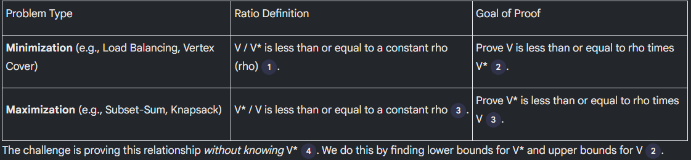

The core goal is to prove that the value of the solution found by an algorithm (V) is "close" to the value of the optimal solution (V*).

Standard Strategy for Minimization Problems:
1. Find a Lower Bound for V*: Identify properties that V* must satisfy, such as the maximum job size or the average load.
    ◦ Example (Load Balancing): V* is greater than or equal to the total load divided by the number of machines (the average load).
2. Find an Upper Bound for V: Analyze the greedy algorithm's structure to prove V is bounded by V* plus some extra terms.
3. Combine the Bounds: Use the lower bounds for V* to relate the "extra terms" in the V inequality back to V* itself.

## Greedy

### Load Balancing - decision NP-complete problem

- Problem: Assign n jobs to m machines to minimize the maximum load on any machine.

Input: m machines, n jobs. Each job j has a processing time t_j.

Constraints: 
- Each job runs contiguously on one machine.
- Each machine processes one job at a time.

Notation:
- Ji - set of jobs assigned to machine i.
- Li - load on machine i = sum of processing times of jobs in Ji.
- L = max(Li) - makespan (maximum load across all machines).

Two always-true lower bounds for the optimal makespan L*:
1. L* ≥ max(t_j) for all jobs j (the makespan must be at least as large as the longest job).
2. L* ≥ total_load / m (the makespan must be at least the average load per machine).

- Goal: Minimize the makespan L.

## Ex. 1 CONJUNTO 1

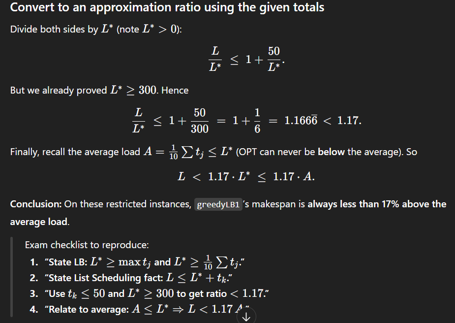

### Vertex Cover Greedy (ex 2 CONJUNTO 1)

#### **(a) greedyVC1**

* **Algorithm:** For each uncovered edge (u,v), add **one endpoint** (e.g. u) to the cover.
* **Problem:** Can pick many unnecessary vertices depending on tie-breaking or order.
* **Counterexample:**
  Star graph — center C connected to n leaves.

  * OPT = {C}, size = 1
  * Algorithm may pick all leaves → size = n
  * Ratio = n / 1 → unbounded
* ✅ **Conclusion:** Not a ρ-approximation for any constant ρ (ratio unbounded).
* greedyVC1 is not a ρ-approximation algorithm for any constant ρ, because in some graphs (like a star), it can produce arbitrarily worse results than optimal.

---

#### **(b) greedyVC2**

```csharp
greedyVC2((V,E)):
    cover = ∅
    for each v in V: inCover[v] = false

    for each (v,w) in E:
        if not inCover[v] and not inCover[w]:
            cover.add(v);  inCover[v] = true
            cover.add(w);  inCover[w] = true

    return cover
```


* **Algorithm:** For each uncovered edge (u,v), add **both endpoints** u and v to the cover.
* **Feasibility:** Always covers all edges (any uncovered edge triggers both endpoints).
* **Key idea:**
  Let **M** = set of edges that caused both endpoints to be added.

  * M is a **matching** (no shared vertices).
  * Any vertex cover must include ≥ 1 vertex per edge in M → |OPT| ≥ |M|.
  * Algorithm adds 2 vertices per edge in M → |ALG| = 2|M|.
    ⇒ |ALG| ≤ 2 × |OPT|.
* ✅ **Conclusion:** greedyVC2 is a **2-approximation** algorithm.

## LP Rounding (Bending the rules)

- Hard Problem (IP - Integer Programming) - Choices must be 0 or 1 (eg. vertex is not/is in the cover)
- Easier Problem(LP - Linear Programming) - Choices can be any value in a range (eg. vertex can be 0.2 in the cover)

We solve the LP, then round the values to get an approximate solution to the IP.

Step:
1. Formulate the problem as a precise Integer Program (IP)
2. Relax into a Linear Program (LP) by allowing variables to take on fractional values.
3. Solve efficiently to find the optimal fractional solution.
4. Round the fractional solution to get an approximate solution to the original IP.

| Goal                     | What you must show                     | Why it’s true                                                                                    |
| ------------------------ | -------------------------------------- | ------------------------------------------------------------------------------------------------ |
| 1️⃣ Feasibility          | The rounded solution covers everything | Because LP constraints guarantee some variable in each constraint was large enough (≥ threshold) |
| 2️⃣ Approximation factor | Cost of rounded ≤ ρ × OPT              | Because each rounded variable ≤ ρ × its fractional value, and fractional OPT ≤ true OPT          |

| Symbol  | Meaning                                  |
| ------- | ---------------------------------------- |
| (x_i)   | decision variable for item i             |
| (x_i^*) | fractional value from the LP             |
| (x'_i)  | rounded (integer) value                  |
| (w_i)   | weight / cost of item i                  |
| (OPT)   | optimal true (integer) cost              |
| (w(x))  | total cost = ∑ wᵢ xᵢ                     |
| (ρ)     | approximation ratio (2 for VC, f for SC) |

### Problem 1 — Maximum Subset-Sum (MSS) CONJUNTO 2


---

#### 1(a) `greedySS1` — “scan once, add if it fits”

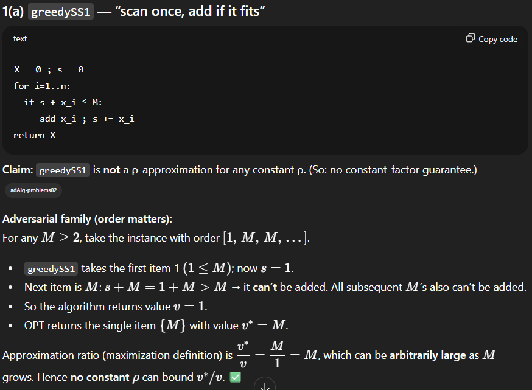

---

#### 1(b) `greedySS2` — “stop at first overflow, compare with the culprit”


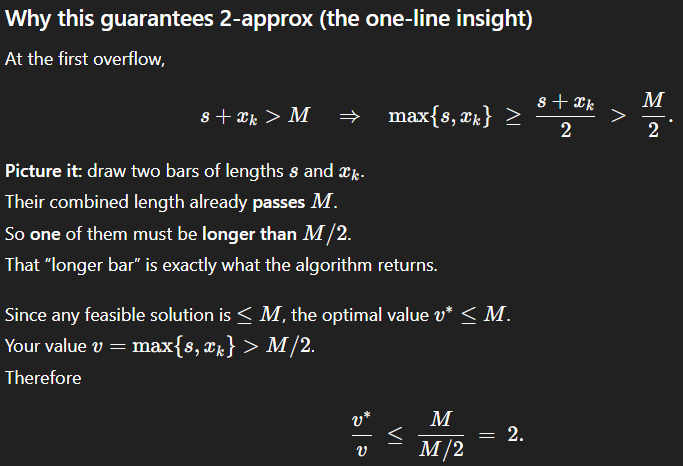

### Problem 2 — Packing containers into trucks of capacity (C)

We must minimize the number of trucks. Greedy rule from the sheet: fill a truck with items w_1, w_2, ... **in order** until the next item would overflow C; dispatch that truck; repeat with a fresh truck. All w_i, C are positive integers and w_i <= C.

---

#### 2(a) Show the greedy may be suboptimal

**Counterexample:** (C=10), items (in order): (6,6,4,4).

* Greedy:

  * Truck1: takes 6; next 6 would overflow → dispatch → load = 6.
  * Truck2: takes 6; next 4 would overflow → dispatch → load = 6.
  * Truck3: takes 4; next 4 fits? yes → Truck3=8 → dispatch.
    **Total trucks = 3.**
* OPT: pack (6+4) and (6+4) → **2 trucks**.

So greedy isn’t optimal.

*(can also use (6,6,4,4) to show it can be **much** worse on longer sequences.)*

---

#### 2(b) Prove the greedy is a **2-approximation**

we need to prove A ≤ 2 OPT.


load(2j−1)+load(2j)>(C−x)+x=C.

So every complete pair carries more than 𝐶 in total.


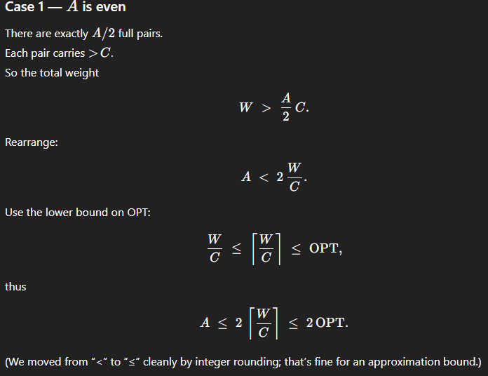

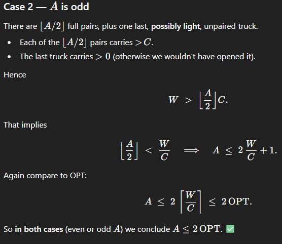

### CONJUNTO 3 - Minimum Dominating Set with LP Rounding

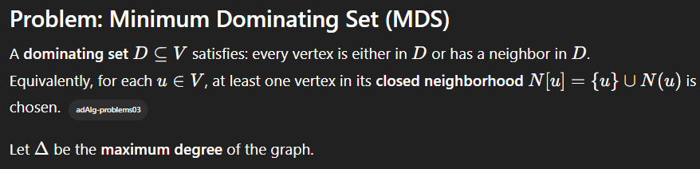

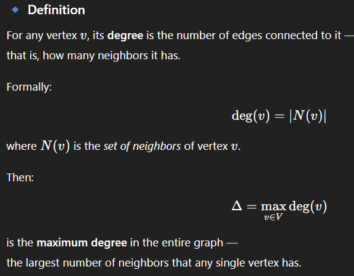

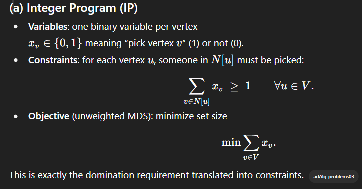

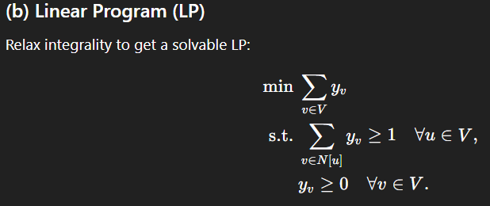

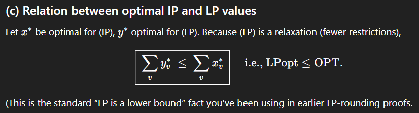

---
Sure! Here’s that entire section rewritten so you can **copy-paste directly into your `.md` file**.
It uses `$...$` and `$$...$$` for math formulas so it renders correctly in Markdown viewers that support LaTeX (VS Code + Markdown Preview Enhanced, Obsidian, Jupyter, etc.).

---

#### (d) Feasibility of (LP): how to think

##### What the LP says

Variables $y_v \ge 0$.
For every vertex $u$, the **closed neighborhood** $N[u]$ (itself + its neighbors) must carry total mass at least 1:

$$
\sum_{v \in N[u]} y_v \ge 1 \quad \forall u. \quad \text{(LP constraints)}
$$

Your job is **not** to solve the LP — just to prove **there exists at least one** assignment satisfying all these inequalities.
If one exists, the LP is *feasible*.

---

##### Thought process

* Start from the constraints: each is “sum over some set of variables ≥ 1”.
* Easiest way to show feasibility is to **exhibit a trivial solution** that satisfies every constraint.
* Here, the trivial assignment $y_v = 1$ for all $v$ works because every $N[u]$ has at least one vertex, so the sum is $|N[u]| \ge 1$.

---

##### What to write

> Set $y_v = 1$ for all $v$.
> Then $y_v \ge 0$ and, for each $u$,
> $$
> \sum_{v \in N[u]} y_v = |N[u]| \ge 1.
> $$
> Hence the LP is feasible.

---

##### General recipe (for exams)

1. Look at each LP constraint’s **shape** (sum over a small set ≥ 1).
2. Plug a **uniform assignment** (all ones, or a small constant) and check it satisfies all constraints.
3. Conclude: “Therefore, the feasible region is non-empty → LP feasible.”

---

#### (e) Boundedness of (LP): how to think

##### What “bounded” means

In a minimization LP, “bounded” means the objective can’t go to $-\infty$.
You just need a **finite lower bound**.

---

##### Thought process

* Objective is $\min \sum_v y_v$.
* All $y_v$ are constrained to be **nonnegative**.
* Therefore $\sum_v y_v \ge 0$ for every feasible $y$.
  That’s a valid finite lower bound ⇒ the LP is bounded.

---

##### What to write

> All variables $y_v \ge 0$ and the objective has nonnegative coefficients,
> so $\sum_v y_v \ge 0$ for every feasible $y$.
> Hence the LP is bounded below.

---

##### General recipe (for exams)

1. Check signs: if variables $\ge 0$ and objective coefficients $\ge 0$, then **objective ≥ 0**.
2. Say: “So it can’t go to $-\infty$, LP is bounded.”

---
### (f)

#### Why the threshold is $1 / (\Delta + 1)$

##### Step 1 — What the rounding threshold must do

When we round the LP solution $y^*$ into integers $x \in {0,1}$, we need two things:

1. **Feasibility:** after rounding, all constraints must still hold.
2. **Small cost:** rounding shouldn’t multiply the cost by too much.

To guarantee **feasibility**, we must choose a threshold $t$ such that:

> If every variable in a constraint were below $t$, the constraint would be violated.

That ensures:

* For every constraint, at least one variable is $\ge t$.
* That variable rounds up to 1.
* The constraint remains satisfied.

So we ask:
👉 *What’s the smallest $t$ that guarantees at least one variable per constraint is $\ge t$?*

---

##### Step 2 — Look at the LP constraint shape

For each vertex $u$, the LP constraint is:

$$
\sum_{v \in N[u]} y_v^* \ge 1
$$

Here $N[u]$ = vertex $u$ and all its neighbors.

---

##### Step 3 — How many terms are in each constraint?

Each $N[u]$ contains at most $\Delta + 1$ vertices:

* $\Delta$ = maximum degree (max number of neighbors)
* $+1$ = vertex $u$ itself

So:

$$
|N[u]| \le \Delta + 1
$$

That means each constraint sums **at most $\Delta + 1$ nonnegative numbers** $y_v^*$.

---

##### Step 4 — The “average” (pigeonhole) argument

The LP constraint says:

$$
\sum_{v \in N[u]} y_v^* \ge 1
$$

If you have **at most $\Delta + 1$** nonnegative numbers whose **sum $\ge 1$**,
then **at least one of them must be $\ge 1/(\Delta + 1)$**.

Otherwise, if all were smaller than $1/(\Delta + 1)$, their sum would be

$$
< (\Delta + 1) \times \frac{1}{\Delta + 1} = 1
$$

which violates the constraint.

That’s the key idea:

> “To reach a total ≥ 1 with at most $\Delta + 1$ values,
> at least one must be ≥ $1/(\Delta + 1)$.”

---

##### Step 5 — Choose threshold $t = 1 / (\Delta + 1)$

We pick this threshold so that:

* For every vertex $u$, at least one $y_v^*$ in $N[u]$ is $\ge t$.
* That $v$ will round to 1.
* Therefore every vertex $u$ is covered (dominated).

This guarantees **feasibility** of the rounded solution.

---

##### Step 6 — Why not use another threshold?

* If you use something **bigger** (e.g., $1/\Delta$), some constraints could fail — their total could still be ≥ 1 even though all values are below that higher threshold.
* If you use something **smaller** (e.g., $1/(2\Delta)$), the rounding would still be feasible but you’d pick more vertices, worsening the approximation ratio.

So $1 / (\Delta + 1)$ is the **tightest safe threshold**:
small enough to guarantee feasibility, large enough to minimize cost.

---

##### Step 7 — How this gives the $(\Delta + 1)$ factor

Once we round using threshold $t = 1 / f$ with $f = \Delta + 1$,
each rounded variable satisfies

$$
x_v \le f \cdot y_v^*
$$

which means rounding can multiply the total cost by at most $f$.

That’s where the **$(\Delta + 1)$** factor in the approximation ratio comes from.

---

##### General reasoning template

Whenever you see a constraint of the form:

$$
\sum_{i \in S} y_i^* \ge 1
$$

1. **Count how many variables** appear in the constraint → $f = |S|$.
2. Use the averaging argument:

   > If all were < $1/f$, their sum < 1 — contradiction.
3. So at least one variable per constraint is ≥ $1/f$.
4. Round using threshold $1/f$ → guarantees feasibility.
5. Rounding up multiplies cost by at most $f$.
6. Hence the algorithm is an **$f$-approximation**.

---

##### In summary

For the Dominating Set LP:

* Each constraint involves ≤ $\Delta + 1$ variables.
* Pick threshold $t = 1 / (\Delta + 1)$.
* Ensures at least one variable per constraint rounds to 1 (feasible).
* Rounding inflates total cost by ≤ $\Delta + 1$.
* ⇒ $(\Delta + 1)$-approximation.

---

**Core intuition:**

> “Each constraint has ≤ f numbers that must sum to 1.
> So one of them must be ≥ 1/f.
> Pick those ≥ 1/f → feasibility and cost blow-up ≤ f.”

## Primal-Dual method

- Every optimization problem (Primal) can be associated with another optimization problem (Dual).


For vertex cover:

Primal (cheapest set of vertices to pick)
Dual (Pricing problem, how high can we raise the prices of edges so that the total price paid by vertices is minimized)


### CONJUNTO 4 - Primal-Dual Minimum Weighted Edge Cover

### **Problem description**

* **Input:** an undirected graph $G=(V,E)$ with edge weights $w_e\ge0$.
* **Goal:** choose a set of edges $C\subseteq E$ such that **every vertex** is incident to at least one edge in $C$, minimizing the total weight

  $$
  w(C)=\sum_{e\in C} w_e.
  $$

---

### **(a) Integer Program (IP)**

Let

$$
x_e =
\begin{cases}
1, & \text{if edge } e \text{ is chosen},
0, & \text{otherwise.}
\end{cases}
$$

Every vertex $v$ must have at least one chosen incident edge ($\delta(v)$ = edges incident to $v$):

$$
\sum_{e\in \delta(v)} x_e \ge 1 \qquad \forall v\in V.
$$

Objective:

$$
\min \sum_{e\in E} w_e x_e.
$$

So the full IP is

$$
\begin{aligned}
\min &\quad \sum_{e\in E} w_e x_e\
\text{s.t.}&\quad \sum_{e\in \delta(v)} x_e \ge 1 && \forall v\in V,\
&\quad x_e\in{0,1} && \forall e\in E.
\end{aligned}
$$

---

### **(b) LP Relaxation (primal P)**

Relax $x_e\in{0,1}$ to $x_e\ge0$:

$$
\begin{aligned}
\text{(P)}\quad
\min &\quad \sum_{e\in E} w_e x_e\
\text{s.t.}&\quad \sum_{e\in \delta(v)} x_e \ge 1 && \forall v\in V,\
&\quad x_e \ge 0 && \forall e\in E.
\end{aligned}
$$

This LP can be solved efficiently, but the solution might be fractional.

---

### **(c) Dual LP (D)**

Each vertex constraint produces a dual variable $y_v\ge0$.
Each edge $(u,v)$ appears in the two constraints for $u$ and $v$.

Hence the dual is:

$$
\begin{aligned}
\text{(D)}\quad
\max &\quad \sum_{v\in V} y_v\
\text{s.t.}&\quad y_u + y_v \le w_{uv} && \forall (u,v)\in E,\
&\quad y_v \ge 0 && \forall v\in V.
\end{aligned}
$$

**Intuition:**
each vertex $v$ pays a “price” $y_v$ to be covered;
an edge $(u,v)$ can only be “paid for” if the combined prices of $u$ and $v$ don’t exceed its cost $w_{uv}$.

---

### **(d) Primal–Dual Algorithm**

**Idea:**
start with all vertices uncovered and $y_v=0$.
Repeatedly raise $y_v$ for an uncovered vertex until some incident edge becomes **tight** ($y_u+y_v=w_{uv}$), then select that edge and mark both endpoints covered.

```text
primalDualEdgeCover(G=(V,E), w):
    y[v] = 0 for all v
    covered[v] = false for all v
    C = ∅

    while exists v with covered[v] = false:
        // raise y[v] until some incident edge (v,u) becomes tight
        Δ = +∞
        for each u with (v,u) in E:
            Δ = min(Δ, w(v,u) - (y[v] + y[u]))
        y[v] = y[v] + Δ

        // choose one tight edge
        choose u with (v,u) tight   // y[v]+y[u] = w(v,u)
        C = C ∪ {(v,u)}
        covered[v] = true
        covered[u] = true

    return C
```

*(Tie-breaking rule: if possible, choose $u$ that is uncovered — used in the ratio proof.)*

---

### **(e) Time complexity**

* Each iteration covers at least one new vertex → ≤ $|V|$ iterations.
* For vertex $v$, computing Δ scans its adjacency $\delta(v)$ → overall $O(|E|)$.
* Bookkeeping is $O(|V|+|E|)$.

**Total:** $O(|V|+|E|)$ time.

---

### **(f) Feasibility of the output**

Each iteration covers at least the vertex $v$ we raised (and its neighbor $u$).
Loop stops only when all vertices are covered.
Therefore, every vertex is incident to some edge in $C$ → $C$ is an **edge cover**.

---

### **(g) Approximation Ratio (2-approx)**

#### Step 1 — Each chosen edge is tight

At selection time $(u,v)$:

$$  
w_{uv} = y_u + y_v.
$$

Total algorithm cost:

$$
\text{ALG} = \sum_{(u,v)\in C} w_{uv}
= \sum_{(u,v)\in C} (y_u + y_v)
= \sum_{v\in V} \deg_C(v),y_v,
$$

where $\deg_C(v)$ = number of chosen edges incident to $v$.

---

#### Step 2 — Each $y_v$ counted at most twice

* When $v$ is first covered, we add one tight edge → $\deg_C(v)=1$.
* Later, $v$ may appear once more as the *already-covered* neighbor of another vertex.
* We always prefer uncovered neighbors → $\deg_C(v)\le2$ for every $v$.

---

#### Step 3 — Bounding the total cost

$$
\text{ALG} = \sum_v \deg_C(v),y_v \le 2\sum_v y_v.
$$

---

#### Step 4 — Relate dual to OPT

By **weak duality**, for any feasible $y$, $\sum_v y_v \le \text{OPT}$.

Therefore,

$$
\boxed{\text{ALG} \le 2\sum_v y_v \le 2,\text{OPT}}.
$$

✅ The algorithm is a **2-approximation**.

---

### **Summary table**

| Concept           | Expression / Explanation                                                                        |   |   |   |    |
| ----------------- | ----------------------------------------------------------------------------------------------- | - | - | - | -- |
| **IP**            | $\min \sum_e w_e x_e$ s.t. $\sum_{e\in\delta(v)}x_e\ge1$, $x_e\in{0,1}$                         |   |   |   |    |
| **Primal (P)**    | Relax $x_e\ge0$                                                                                 |   |   |   |    |
| **Dual (D)**      | $\max \sum_v y_v$ s.t. $y_u+y_v\le w_{uv}$, $y_v\ge0$                                           |   |   |   |    |
| **Algorithm**     | Raise $y_v$ for uncovered $v$ until a tight edge $(v,u)$ forms; add $(v,u)$; mark $u,v$ covered |   |   |   |    |
| **Feasible**      | Loop ends when all vertices covered → edge cover                                                |   |   |   |    |
| **Cost bound**    | $\text{ALG}=\sum_v \deg_C(v)y_v \le 2\sum_v y_v \le 2\text{OPT}$                                |   |   |   |    |
| **Approximation** | **2-approximation**                                                                             |   |   |   |    |
| **Complexity**    | $O(|V| + |E|)$                                                                                   |   |   |   |    |

---

### **Core intuition**

> * Start with all vertices uncovered.
> * Raise their “prices” $y_v$ until some edge becomes tight → select that edge.
> * Each vertex’s price appears in at most two selected edges → factor 2.
> * Weak duality gives $\sum_v y_v \le \text{OPT}$ → total cost ≤ 2 × OPT.

✅ **Result:** the primal–dual algorithm for MEC runs in $O(|V|+|E|)$ and is a **2-approximation**.
