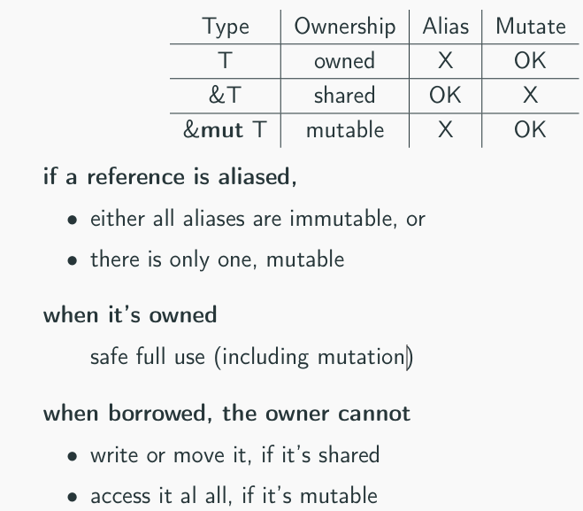
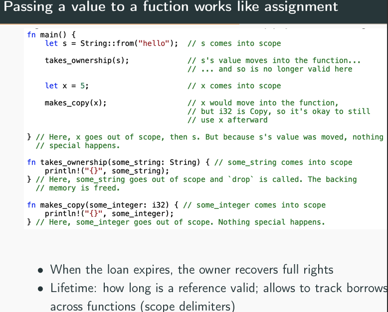
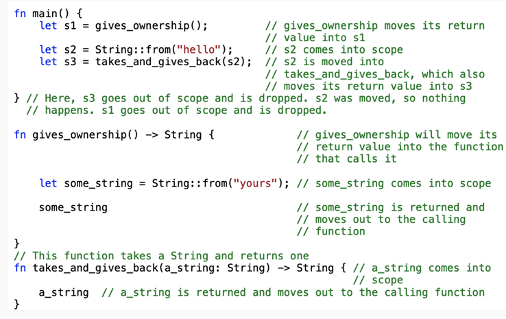
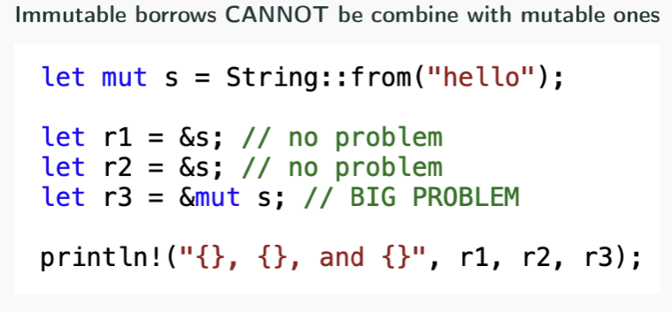
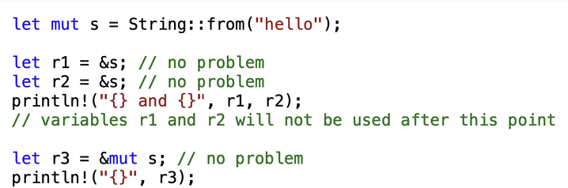
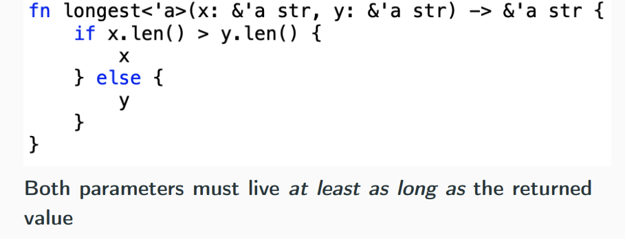

# Programação Concorrente: Linguagens e Técnicas

## Why rust?

Proposito: uma linagugem de **sistemas**, para escrever os e drivers, que seja rapida e segura.

Why not C/C++?
- Imprecisão, comportamento indefinido ou inexperado, problemas com gestão de memória e concorrencia (data races)

### Restrict aliasing, as it is hard and dangerous

- A firm approach: References are unique and mutable by default.
- Ownership via linear types:
- Each value has a single owner 
- owner might give away or lend their values
- When owner goes out of scope, value is dropped
- When shared, values become immutable

rust borrows references, controlling them until found unusable, and restoring then uniqueness and mutability.

Immutable borrowss CANNOT be combine with mutable ones.

https://plv.mpi-sws.org/refinedrust/ - Type system for high-assurance verification of rust programs~.

- Errors in concurrency are hard to find:
- simulate nondeterministic interleavings of threads
- rely on luck

