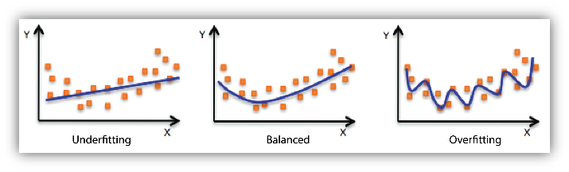

# Machine Learning - Introdução

- Learning from previous data to make decisions (learn from experience)

- Since we can't program everything by hand, we need to write a program that learns the information from the data.

- What is a learned model? 
  - High-capacity parametric function
  - Optimizing the closeness of the model function to training data

- Try and error technique

## The learning paradigm

- It's not easy to diferentiate between similar objects (eg. a dog that looks like a mop and an actual mop, or different mushroom types)

### Practical learning example

- Imagine we need a credit approval with som applicant information (age, gender, salary, ...) and we need to approve or deny the credit request.
- We can use a model to predict the outcome of the credit request based on the applicant information.
- For that we need to train the model with previous data (approved and denied requests).
- For this we use tables with the information, and this generate a matrix.

**N examples, d Features**

f(x) = ? => **A** Data table => **Learning Model** => g(x) Empirical solution.
 
Hipotheses Set => Learning Algorithm=> Learning model 

## Types of Learning

**Supervised Learning** - We need to have the correct answer to train the model.
  - Classification -> classes
  - Regression -> real Continuous intervals
If we don't have the correct answer in order to find the right answer, we need to use **Unsupervised Learning**.

For this we need to find **patterns** and **structure**, is the data clustered? Is there a pattern?

## Linear Models

Linear models are just the part of the model that takes the decision, a **linear classifier**.

Feature learning is the part of the model that starts to learn the features of the data, trying to find the best features to make the decision.

## Supervised Learning: A closer look into regression

### Example: Estimate the minutes needed to read a text

we want to find the high capacity parametric function in order to calculate the time needed to read a text.

for that we also need the **data table** with examples.

A = [ X y ]

the model allows to **predict** y based on X.

- We need to find the function (f(x)= mx + b), in this case we need to **find the m and b** values, that **minimize the residuals** (the difference between the predicted value and the real value).

Closed form solution: **Least Squares**

alpha = (X^T * X)^-1 * X^T * y

problems if it's a matrix that's too large.

**polynomial regression** is a way to solve this problem, by adding more features to the model.

Vandermonde matrix

**Overfitting** is when the model is too complex and tries to fit the data too much, and it's not able to generalize to new data.
**Underfitting** is when the model is too simple and can't fit the data well.

### Gradient descent algorithm

- This is a simple algorithm that allows to find the minimum of a function.

L(alpha) is the loss function, and we need to find the minimum of this function.

L(alpha) = ||X * alpha - y||^2

alpha(1) = alpha(0) - eta * dL(alpha)/dalpha

we take the previous value, we take the gradient of the function, and we multiply by the learning rate.
