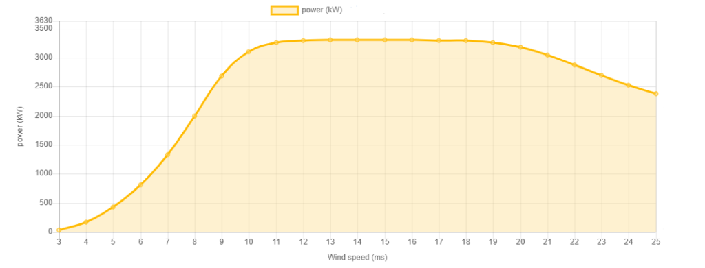

# Formação Produção energia elétrica - Conceitos técnicos e económicos - @ISEL 15/10/2024

- GAMS - Softwaare que usa

- potência do secador 1500 W - n está a atuar
- 5 minutos com o secador ligado = 1500 W * 5 min = 7500 Wmin = 7500/60 Wh = 125 Wh

## Central Hidraúlica

através de uma barragem cria energia potêncial
Albufeira
Com uma válvula de descarga, a água passa por uma turbina, que faz girar um gerador (alternador), convertendo energia mecânica em energia elétrica.
pelo rotor, passa uma corrente i para gerar um fluxo magnético.
o estator, que é fixo, tem um campo magnético que interage com o campo magnético do rotor, gerando uma força eletromotriz (fem) que gera uma corrente elétrica.
Através de um transformador, regula a tensão e a corrente que entra na rede elétrica, distribuida através de linhas de transmissão.

p=u*i

## Central Térmica

através de uma caldeira e inscerção de combustível, sai vapor de água altamente pressionado, é injetado numa turbina que faz girar um gerador, convertendo energia mecânica em energia elétrica.
o vapor de água é condensado e volta a ser injetado na caldeira, refrigerado.

Enxofre, NOx, SO2, etc, são filtrados agtravéz de filtros, e são lançados para a atmosfera.
**CO2 é importante porque são as emissões realizadas é preciso ter em conta.**

## Central Ciclo Combinado

Combinação de uma central térmica com uma central de ciclo a gás.
O gás natural é queimado, e o vapor de água é injetado numa turbina, que faz girar um gerador, convertendo energia mecânica em energia elétrica.
Não só entra gás como entra ar em pressão (comprimido) que é injetado numa turbina a gás, que faz girar um gerador, convertendo energia mecânica em energia elétrica.
Os gases de escape são aproveitados por uma caldeira de recuperação, produzindo mais energia elétrica (este processo é o de uma central térmica).

CCGT - Combined Cycle Gas Turbine

## Central Nuclear

- Espanha por enquanto tem mas vai sair

Estas centrais são muito caras, e têm um custo de manutenção muito elevado, por questão de restrições de segurança.

Em vez de queimar um combustível, usa um reator nuclear (colocado Uránio 235) que é bombardeado por neutrões, que fazem com que o núcleo do Uránio se divida em dois núcleos mais pequenos, libertando energia e mais neutrões. Este processo é chamado de fissão nuclear.

SMR - Small Modular Reactor, visam resolver problemas de segurança e custos.

## Novas renovaveis

De forma a vender banda, podemos atuar numa posição sub-ótima, de forma a regular a produção de energia. 

### Central Eólica

- A energia eólica é a energia cinética do vento, que é convertida em energia mecânica através de um rotor, que faz girar um gerador, convertendo energia mecânica em energia elétrica. 30 anos de vida útil. 

### Fotovoltaica

precisa de bons níveis de radiação, julho e agosto não são os melhores meses de produção, porque a temperatura em excesso diminui a eficiência dos painéis solares.

## Perfis de produção

- Hidrica oferece o que é preciso
- CCGT oferece boa flexibilidade, mantendo mínimos técnicos de noite e podendo aumentar a produção durante o dia. Funciona por ciclos.
- Nuclear é constante, não é flexível.
- Carvão é quase constante, não é flexível.
- Eólica é variável, (o que o vento mandar)

## Emissões

- Térmica, usa Combustivel, tem emissões de CO2 que é pago, e o SO2 e NOx são controlados, gerando Y energia.

## Fundamentos Económicos

- Custo variáveis de combustível
- Custo variáveis de emissãpo
- Custo de O&M fixos e variáveis
- Custos de arranque e paragem
- Custo de investimento
- Custos de desclassificação
- Custos de manutenção